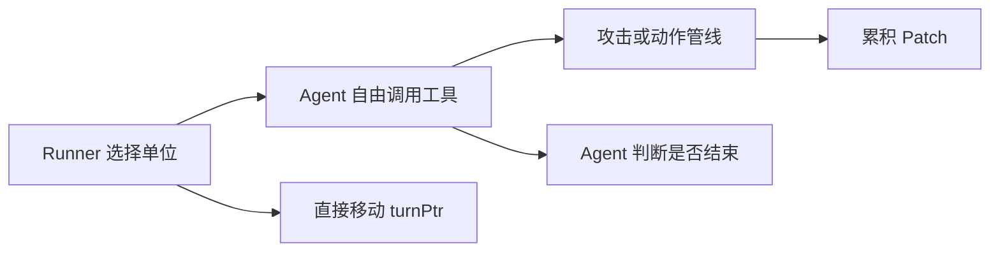
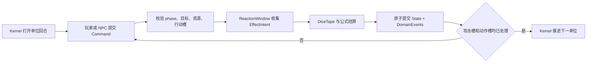
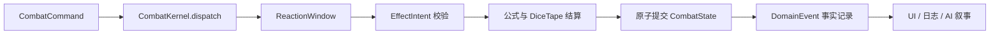

# 战斗 v3 CombatKernel 架构提案

> 来源：Codex 的讨论文档（message 1 + 2），本喵瞄审核中。与 combat-event-system-review.md / repo-management-draft.md 为同一批产出。

---
## Part 1: 现状对照 + 迁移映射

一句话概括：现有系统是“Agent 主持流程、代码辅助结算”，提议系统则是“代码内核主持流程、Agent 辅助决策与叙事”喵  

### 逐层对照

| 维度 | 当前设计及实际状态 | 提议系统 |
|---|---|---|
| 流程控制 | `CombatRunner` 让模型调用工具并决定何时 `combat_end`，随后直接移动 `turnPtr` 喵 | `CombatKernel` 根据 phase 和行动预算决定唯一合法的下一步，Agent 只是 Command 来源喵 |
| 行动经济 | 已有 `attacksRemaining/actionsRemaining` 和消费函数，但生产攻击管线没有调用它们，模型一次回合最多可连续调用 40 次工具喵 | 每个 Command 必须声明 `attack/action/both` 成本，内核验证并消费，两个槽位耗尽或主动放弃后才能结束单位回合喵 |
| 回合生命周期 | 已实现 `runRoundPipeline`，但 runner 直接 `round++`，所以 round start/end、Buff tick 实际没有接入喵 | round open、initiative、unit turn、round close 是显式状态机 phase，不可能绕过喵 |
| 事件语义 | 同时存在 `publish` 通知、`emitChain` 可变参数链，以及单独的 UI `CombatEvent`，三者都叫事件喵 | 明确分为 `CombatCommand`、`ReactionWindow`、`DomainEvent`，每种只有一个职责喵 |
| 状态权威 | `combatState`、`deps.characters`、返回结果和 `allPatches` 同时存在，攻击后还需手工同步 defender HP 喵 | 一个权威 `CombatState`，每个 Command 产生一次原子 `CombatTransition` 喵 |
| 随机数 | 骰值部分由工具输入，initiative、优势骰和脚本仍可能调用 `Math.random()` 喵 | 所有随机数来自带 cursor 的 `DiceTape`，脚本和 Agent 都不能制造骰值喵 |
| 技能脚本 | `new Function` 执行 AI 生成的 JavaScript，脚本可收集 HP、属性和状态写入喵 | 非可信内容只能生成受限的 `EffectIntent`，由内核验证后解释执行喵 |
| 技能生命周期 | `ScriptRegistry` 和 `SubscriptionManager` 分别管理静态、动态订阅，但生产路径尚未完整实例化和接线喵 | 从当前装备、技能和状态派生 `ActiveEffectIndex`，进入、离开或过期时统一更新喵 |
| 持久化 | 战斗过程中累积 patches，循环结束后一次写入，部分战斗状态靠额外手工同步维持喵 | 战斗内每步写入 journal，终局再通过 StateManager adapter 幂等提交持久状态喵 |
| AI 权限 | AI 选择动作、提供参数、调用骰子、决定结束并书写叙事，权责混在一起喵 | AI 可以选择 Command、提出特殊效果方案和生成叙事，但不能决定已发生的数值事实喵 |

当前这些断点已经在[战斗系统审查报告](/E:/Projects/IndependentFront-for-destined-journey/docs/planning/2026-07-30-combat-event-system-review.md:12)中得到端到端验证喵  

### 当前系统值得保留的部分

它并不是应该全部推翻的系统喵  

- `combat-damage.ts` 的纯函数伤害步骤、评级和防御计算可以作为新内核的 implementation 喵  
- `combat-intention.ts` 可以保留，只需改为消费两颗独立骰并补回非致死结算喵  
- [combat-turn.ts](/E:/Projects/IndependentFront-for-destined-journey/src/sillytavern/combat-turn.ts:20) 的先攻公式和行动槽模型可以保留，但必须由内核实际调用喵  
- modifier 六大类别和优先级机制适合作为 EffectIntent 的数值层喵  
- `StatePatch` 与 StateManager 可以继续作为持久化 adapter 喵  
- UI 使用的 `CombatEvent` 可以改为订阅 DomainEvent 的 projection，而不必重写展示层喵  

特别值得注意的是，当前 `ScriptEffects` 已经接近“效果意图”的雏形，因为它先收集变化，再由调用方转为 patch 喵  

问题在于它仍然暴露了 `modifyHp`、`modifyStat`、任意事件字符串和任意 JavaScript，而且[转换过程](/E:/Projects/IndependentFront-for-destined-journey/src/sillytavern/state-manager.ts:1397)会直接把这些请求降为底层路径写入喵  

因此可以演进 `ScriptEffects → EffectIntent`，而不必从零设计全部技能数据喵  

### 最关键的控制流差异

当前流程实际上是这样喵  



提议流程则是这样喵  



这会直接修正当前 runner 的核心偏差：[现有循环](/E:/Projects/IndependentFront-for-destined-journey/src/sillytavern/combat-runner.ts:331)把“一次模型响应”当成“一个单位完整回合”，但原版要求一个单位在本轮实际处理一个攻击槽和一个动作槽喵  

### 事件系统的真正变化

当前 [EventBus](/E:/Projects/IndependentFront-for-destined-journey/src/sillytavern/game-event.ts:83) 内部包含两套互不相通的机制喵  

- `publish()` 是事后通知，不能改变结果喵  
- `emitChain()` 是按优先级传递并修改任意参数对象喵  
- runner 的 `CombatEvent` 又是第三条只给 UI 使用的通道喵  

提议系统不是删除事件，而是给每类事件明确权力喵  

- `ReactionWindow` 可以返回受限 intent，但不能直接推进战斗或写状态喵  
- `DomainEvent` 只能描述已提交事实，供 UI、叙事、回放和审计消费喵  
- 普通 `GameEvent` 继续用于战斗外的剧情、任务和地点通知，不必强迫整个游戏迁移喵  

### 推荐的迁移映射

| 当前 module | 新位置 |
|---|---|
| `combat-runner` | `CombatSessionCoordinator`，负责连接 UI、Agent 和内核喵 |
| `combat-pipeline`、`combat-resolver` | `CombatKernel` 内部 implementation 喵 |
| `emitChain` | `ReactionWindowEvaluator` 喵 |
| `ScriptRegistry`、`SubscriptionManager` | `ActiveEffectIndex` 喵 |
| `script-executor` | 声明式 DSL interpreter，可信内建效果使用 TypeScript adapter 喵 |
| `CombatEvent` | DomainEvent 到 UI projection 的 adapter 喵 |
| `StateManager` | 战斗外持久化 adapter 喵 |

所以我会把这个方向定义为“收拢和替换接线层”，而不是重写所有战斗公式喵  

最适合的第一步，是用原版协议写一组黑盒 contract tests，然后让 legacy 与新 `CombatKernel` 同时跑这些输入，对比行动顺序、骰子 cursor、伤害、状态、士气和结算结果喵
---
## Part 2: CombatKernel + EffectIntent + 不变量

主人，我已经调出了[原始 lorebook](/E:/Projects/IndependentFront-for-destined-journey/reference/v4.2.1_chara_card.json)，重点核对了 `#837805 战斗协议`、`#261442 技能装备道具生成规则`、`#597443 状态规则` 和 `#884517 随机池` 喵  

我的结论很明确：保留原版战斗流程，但不要让事件或脚本负责推进流程；它们只应在内核预留的 seam 中改变“这一步如何结算”喵  



### 先把三个容易混淆的概念拆开

- `CombatCommand`：角色或系统提出的请求，例如攻击、使用技能、跳过动作、逃跑、接受投降喵  
- `ReactionWindow`：结算前后的扩展 seam，技能、状态和装备可以返回受限的 `EffectIntent` 喵  
- `DomainEvent`：已经发生且不可修改的事实，例如 `DamageApplied`、`UnitDowned`、`CombatEnded`，用于 UI、回放和叙事喵  

当前实现把“可修改的 chain”和“事后通知”都称为 event，这是最容易导致控制流、状态写入和生命周期混乱的地方喵  

### 原版流程由 CombatKernel 独占

| 原版阶段 | 内核职责 | 可开放的脚本窗口 |
|---|---|---|
| 战况总览 | 从唯一 CombatState 生成投影 | `round.open` |
| 每轮先攻 | 原公式与 d20 顺序消费 | `initiative.before/after` |
| 单位回合 | 强制每轮 `1 攻击 + 1 动作` | `turn.open/close` |
| 攻击结算 | 意图、命中、伤害、防御、状态 | `check.*`、`damage.*` |
| 战术动作 | 道具、移动、防御、专注、逃跑 | `action.declared` |
| 士气判断 | 原阈值、战斗类型和随机规则 | `morale.before/after` |
| 回合结束 | Debuff、持续伤害、持续时间 | `round.close` |
| 战斗结算 | 仅终局触发，奖励只能提交一次 | `settlement.before` |

`CombatKernel` 应是一个 deep module，对外只暴露类似下面的 interface 喵  

```ts
dispatch(command: CombatCommand): CombatTransition

type CombatTransition = {
  nextState: CombatState
  events: readonly DomainEvent[]
  waitFor?: PendingChoice
}
```

脚本不能调用 `nextTurn()`、`endCombat()`、`modifyHp()` 或直接写入角色数据，因为这些能力会绕过原版流程和不变量喵  

### 技能不要写任意 JavaScript，而应提交 EffectIntent

```ts
type EffectIntent =
  | AddModifier
  | DealDamage
  | Heal
  | SpendResource
  | ApplyStatus
  | RemoveStatus
  | RedirectTarget
  | CancelAction
  | PreventDeath
  | GrantActionSlot
  | ConsumeCharge
  | SummonUnit
  | ScheduleEffect
  | RequestChoice
  | EmitNarrativeCue
```

普通技能由声明式 trigger、条件 AST 和这些操作组合出来，特殊技能可以提出更复杂的 intent，但最终仍由内核验证目标、品质、神性、次数、资源和数值范围喵  

例如“一次致死伤害时保留 1 HP”不是直接修改 HP，而是在 `unit.beforeDown` 返回 `PreventDeath` 与 `ConsumeCharge` 喵  

“反射所受伤害的 30%”则在 `damage.after` 创建新的 `DealDamage`，并携带 `rootChainId` 和递归深度限制，既能表达创意，又不会产生无限反伤喵  

真正无法用已有词汇表达的能力，可以让 AI 返回一个受约束的 `ProposedEffectPlan`，而不是让 AI 执行代码或宣布最终结果喵  

### 必须锁死的五条不变量

- 每单位每轮恰好拥有一个攻击槽和一个动作槽，跳过也会消费对应槽位喵  
- 额外行动只能来自经过验证的 `GrantActionSlot`，不能由脚本直接推进回合喵  
- 所有随机数来自内核持有的 `DiceTape`，并保留原作每次输出 60 个 d20、依次消费的语义喵  
- 所有 HP、资源、状态和行动槽变化必须经过同一次原子提交喵  
- `CombatEnded` 和奖励结算按 `combatId + settlementId` 保证幂等，不能重复结算喵  

### 对现有 v2 的判断

我不建议继续往当前 19-event pipeline 上打补丁，因为现有[审查报告](/E:/Projects/IndependentFront-for-destined-journey/docs/planning/2026-07-30-combat-event-system-review.md:12)已经证明核心 runner、pipeline、脚本注册和状态回写没有形成一条权威路径喵  

另外，[当前 EventBus](/E:/Projects/IndependentFront-for-destined-journey/src/sillytavern/game-event.ts:83)同时承担通知和可变 chain，而[脚本执行器](/E:/Projects/IndependentFront-for-destined-journey/src/sillytavern/script-executor.ts:164)使用 `new Function`，所以它既不是真正的 sandbox，也很难保证可复现战斗喵  

更稳妥的演进方式是并行建立一个小型 v3 `CombatKernel`，先用原版协议测试锁定行为，再依次加入 `DiceTape`、ReactionWindow、EffectIntent，以及三个压力测试技能，最后才接 AI 叙事和 UI 喵  

我建议我们下一步把它写成一份 RFC，先固定“严格保留 `1攻击+1动作`、每轮先攻、士气阶段和 60-d20 顺序池”这一档语义，然后用三到五个最离谱的创意技能反向验证这套 effect vocabulary 是否足够深喵