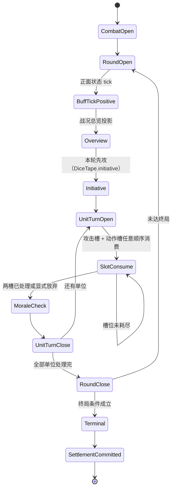

# 战斗系统架构（Combat System Architecture）v3

> 📌 **文档定位**：战斗 v3 的**正式架构真源**。取代 [`docs/archive/planning/2026-07-30-combat-kernel-v3-proposal.md`](../archive/planning/2026-07-30-combat-kernel-v3-proposal.md) 的骨架级提案，整合压测 + 补丁 RFC（`2026-07-31-combat-v3-real-sample-stress-test-rfc.md`，已移入私有内容仓 `fated_poem_independent_assets/docs/planning/`，公开仓侧不可见）§5/§6 全部补丁、[架构交接地图](../archive/planning/2026-07-31-combat-v3-architecture-handoff.md) §3/§4 边界结论，以及 2026-07-31 主人拍板的 D1–D6 决策。
>
> ⚠️ **与 v2 的关系**：本文档**不重复** [`combat-system-architecture.md`](./combat-system-architecture.md)（v2 真源）已定义的纯计算规则。8 步伤害管线、6 大效果类别、意图层级、命中评级、战意阈值、核心数值表**原样保留**，本文只标注它们在 v3 中的调用位置与修正点，具体公式请回查 v2 对应章节。
>
> 🔗 **关联文档**：[v2 架构](./combat-system-architecture.md) · [v2 审查报告](../archive/planning/2026-07-30-combat-event-system-review.md) · 压测 RFC + 5 场脑测案例集（`2026-07-31-combat-v3-real-sample-stress-test-rfc.md` / `2026-07-31-combat-v3-stress-test/`，已移入私有内容仓 `fated_poem_independent_assets/docs/planning/`，公开仓侧不可见） · [统一效果系统框架 ADR-29](../planning/unified-effect-system-framework.md) · [effect_script_system.md](./effect_script_system.md)

> 🎭 **定位纠偏（2026-08-12，读全文前必看）**：本文初稿（2026-07-31）成文时，战斗 Agent（`combat_v3`）
> 被设计成**敌方专属决策器**——只在敌方单位轮次被叫到，玩家轮次完全绕过它。2026-08-12 的改造把它
> **重定位为「战斗主持人 / DM」**：同一条持久会话贯穿整场、同时服务两侧。
>
> - **玩家轮次**：玩家提交的是**自由意图文本**（不是拼装好的 Command）→ 主持人读懂意图 → 调
>   `declare_attack` / `declare_action` / `pass_slot` / `flee` / `end_turn` 替玩家声明动作 → 内核照旧
>   校验并消费槽位。前端四步拼装那条结构化路径仍直接产 Command，不过主持人（真源：
>   `combat-v3/coordinator.ts` 的 `routeHostCommand` / `routePlayerIntent`，均带 `🎭 2026-08-12` 注释；
>   prompt 真源：`public/data/defaults/agent-config.json` 的 `combat_v3.systemPrompt` 首句
>   「你是《命定之诗》**战斗主持人（DM）**」）。
> - **敌方轮次**：扮演当前敌方单位做战术决策——**这只是主持人诸多职责之一**，不再是它的全部定位。
> - **结算演绎**：内核算完后写结果句。
>
> 权责边界**未变**：内核仍主持状态机 / 骰子 / 伤害 / 生死 / 战意 / 终局，主持人只读意图、做战术决策、
> 写演绎（P4 / ADR-11 原样成立）。下文 §2.3 / §14.7 已按新定位改写；其余章节里凡写「敌方决策」处，
> 请按「主持人的敌方轮次职责」理解。
>
> 另有一条**确定性兜底**：自由文本还有一条零 I/O 的规则解析路径 `combat-v3/player-input.ts`
> （关键词 + 名字匹配，解析不出就明确拒绝、绝不静默 fallback 成 PassAttack），详见 §14.1。

---

## 0. 内容索引

- [一、定位与设计目标](#一定位与设计目标)
- [二、核心控制模型](#二核心控制模型)
- [三、CombatState 与原子提交](#三combatstate-与原子提交)
- [四、DiceTape 骰带](#四dicetape-骰带)
- [五、ReactionWindow 清单](#五reactionwindow-清单)
- [六、EffectIntent 词汇与 schema](#六effectintent-词汇与-schema)
- [七、EffectAutomaton DSL 与编译链](#七effectautomaton-dsl-与编译链)
- [八、closed RuleKey 与 divinity 压制](#八closed-rulekey-与-divinity-压制)
- [九、反射（反伤）专项规范](#九反射反伤专项规范)
- [十、char_gen 战斗中调用](#十char_gen-战斗中调用)
- [十一、BoundedAdjudication 有界裁决](#十一boundedadjudication-有界裁决)
- [十二、FP 跨边界协议](#十二fp-跨边界协议)
- [十三、DomainEvent 目录与双投影](#十三domainevent-目录与双投影)
- [十四、引擎边界与对接](#十四引擎边界与对接)
- [十五、模块迁移映射表](#十五模块迁移映射表)
- [十六、已确认决策记录与开放问题](#十六已确认决策记录与开放问题)
- [十七、世界书与参考来源](#十七世界书与参考来源)

---

## 一、定位与设计目标

### 1.1 一句话定位

v3 把 v2 的「**Agent 主持流程、代码辅助结算**」翻转为「**代码内核主持流程、Agent 辅助决策与叙事**」。这不是从零重写——纯计算函数（伤害管线 / 意图对抗 / 先攻 / 士气 / 制作评级）全部保留，重写的是**控制流接线层**（runner / pipeline / EventBus emitChain / script-executor）。

### 1.2 五条设计原则

| # | 原则 | 含义 |
|---|------|------|
| P1 | **单一权威** | 一场战斗内只有一个 `CombatState`、一条 `DiceTape`、一个 settlement owner。任何"第二状态源"都是 bug |
| P2 | **单一入口** | 所有变更走 `CombatSession.dispatch(command)`。不暴露 `close()` / `nextTurn()` / `modifyHp()` / EventBus / ScriptRegistry |
| P3 | **可重放** | 同 bundle + 同 DiceTape + 同 Command 序列 ⇒ DomainEvent 序列逐字节一致。零 `Math.random()`、零 `new Function`、零 wall-clock |
| P4 | **创造性归 Agent，确定性归内核** | Agent 选 Command、提创意方案、写叙事；内核判定已发生的数值事实。开放性创意走有界裁决而非硬塞词汇（ADR-11） |
| P5 | **玩法表达力优先于不变量优雅** | 不变量为保护数值严谨性存在，不是削减原版玩法的借口。原版语义（召唤物当回合参战 / 濒死免死 / 概念判胜）与不变量冲突时，用**显式受控出口**解决，不单方面改规则 |

### 1.3 v3 相对 v2 的四类动作

| 动作 | 对象 | 说明 |
|------|------|------|
| ✅ **原样保留** | 8 步伤害管线（v2 §八）、6 大效果类别（v2 §四 4.1）、效果转化表（v2 §四 4.3）、buff 6 字段与去重（v2 §五）、七层级系数（v2 §九 9.1）、命中评级（v2 §九 9.2）、意图层级（v2 §九 9.3）、类型减免（v2 §九 9.4）、战意阈值（v2 §九 9.5） | 纯计算，公式不动 |
| 🔧 **保留 + 修正** | `performAttackCheck` 优劣势第二颗骰、意图对抗骰源、非致死结算、最终伤害下界、士气 d20 | 见 §1.4 |
| 🔻 **替换接线** | `combat-runner` / `combat-pipeline` / `combat-resolver` / `emitChain` / `script-executor` / `ScriptRegistry` + `SubscriptionManager` | 见 §十五 |
| 🆕 **新增** | DiceTape / ReactionWindow / EffectIntent / EffectAutomaton / closed RuleKey / BoundedAdjudication / CharGenRequest / DomainEvent 双投影 | 见 §二–§十三 |

### 1.4 五处代码现状修正（v3 必须落地）

以下由代码勘察确认，是 v3 设计的硬依据，不是可选优化：

| # | 现状 | v3 修正 |
|---|------|---------|
| C1 | `script-executor.ts` / `effect-runtime.ts` 用 `new Function` 执行 AI 生成的 JS，既非 sandbox 也不可重放 | 全链路零 `new Function` / `eval`，改用封闭微文法表达式解释器（§七） |
| C5 | 意图对抗攻守共用同一颗骰——纯函数 `IntentionCheckInput` 本有 `attackerD20` / `defenderD20` 两字段，bug 在调用点 `combat-pipeline.ts:219-220` 同值双喂 | 消费**两颗独立骰**，走 `intentCheck` 通道 |
| C6 | 非致死意图未回调 `checkNonLethal`，非致死攻击可致死 | 攻击结算末尾补回 `checkNonLethal`，与 `unit.beforeDown` 窗口协同 |
| C7 | 最终伤害未 clamp，负修正可产出负伤害（等效治疗） | 最终伤害 `clamp(x, 0, +∞)`，治疗必须显式走 `Heal` outcome |
| M-4 | `combat-morale-pipeline.ts` 士气 d20 来自调用方随意传入 | 士气 d20 从 DiceTape `statusContest` 通道取 |

**另有一处关键事实修正**：`performAttackCheck`（`src/sillytavern/combat-damage.ts:392-408`）在层级优劣势分支里用 `Math.random()` 内部**模拟**第二颗骰（注释写着 `simulated second roll`）。v3 中该函数签名必须改为显式接收两颗骰（`d20Rolls: [number, number?]`），骰值只能来自 DiceTape。相应地，**v3 战斗 Agent 的工具集不再包含 `roll_d20`**——v2 由 LLM 调工具产骰、再作为参数传入纯函数的模式被彻底取消。

### 1.5 ADR 对齐

| ADR | 内容 | v3 落点 |
|-----|------|---------|
| **ADR-11** | Prompt vs Code 边界 | 参战时机 / 奇迹是否触发 / 概念抹杀是否成立 / 叙事 = Agent；插入先攻、扣血、到期移除、数值边界、不变量 = 内核（§十、§十一） |
| **ADR-19** | $ API 语义级抽象 | Agent 提交 `CombatCommand` 声明意图（DeclareAttack / DeclareAction），内核内部执行公式。不暴露 `modifyHp()` 等 CRUD 原语（§二） |
| **ADR-20** | 声明式优先 | 效果先用 EffectIntent 声明式表达；无法表达时走 **EffectAutomaton DSL**（仍是声明式），而非任意脚本（§七） |
| **ADR-21** | StateManager 为唯一写入入口 | 战斗内 CombatState 是内存权威，**终局一次** `commitChatState()` 落库；战斗中途不写存档（§十四 14.4） |
| **ADR-28** | 世界书是给纯文本 AI 的协议 | 骰池/文本面板是原版的文本手段。v3 保留 60-d20 **顺序消费语义**（结果层对齐），但内部实现为分通道 DiceTape（中间结构不照抄）（§四） |
| **ADR-29** | 统一效果系统框架 | `modifiers[]` 不是第二套系统——编译为订阅 `collect_*_mods` 窗口、返回 `ModifierIntent` 的 push-handler automaton，与 AI 效果走同一条求值链（§七 7.3） |

### 1.6 否决项清单（明确不做）

| 否决项 | 理由 |
|--------|------|
| **同场战斗内按 action/skill 混用 v2/v3** | 会重新制造两套行动槽、两套 buff 生命周期、两套状态权威。feature flag 只能按**整场战斗**切换（§十四 14.5） |
| **完整 shadow dual-run（v2/v3 并跑对比）** | v2 含 `Math.random()` 和不确定的 Agent 工具调用次数，会污染真实骰带且无法公平比较。安全验证只用纯公式 differential test + 固定 DiceTape replay + 不写状态的离线 journal replay（§十六 D5） |
| **任意 `TransformRule` DSL** | 本质上会把整个内核重新暴露给 DSL。法则级能力只能操作内核拥有的 **closed RuleKey**（§八） |
| **向外暴露 `close()` / `nextTurn()` / `endCombat()` / `modifyHp()` / EventBus / ScriptRegistry** | 每一个都是绕过原版流程与不变量的第二条控制路径 |
| **DiceTape 通道间借用余骰** | 借用会让 replay 依赖跨通道消耗历史，破坏可重放性。耗尽即换 epoch（§四 4.4） |
| **中途持久化 checkpoint 落 IndexedDB 作为 M1 需求** | v2 中途崩溃本来就全丢，v3 的内存 journal + 原子结算已严格更优。落库属 M5+ 可选增强（§十六 D1） |

---

## 二、核心控制模型

### 2.1 公共接口（唯一对外面）

```ts
interface CombatEngine {
  openCombat(input: NewCombat | RestoreCombat): CombatSession;
}

interface CombatSession {
  dispatch(command: CombatCommand): CombatTransition;
}

interface CombatTransition {
  revision: number;                     // 提交后的状态版本号，单调递增
  snapshot: Readonly<CombatView>;       // 只读投影（UI / Agent prompt 用）
  events: readonly DomainEvent[];       // 本次提交产生的既成事实
  requiredInput?: RequiredInput;        // 下一步需要的外部输入（无则可继续 dispatch）
  rejection?: CommandRejection;         // 命令被拒（此时 events 为空、骰子零消费）
  checkpoint: CombatCheckpoint;         // 可用于 RestoreCombat 的恢复点
}
```

内部仍是纯 reducer，但那是 **implementation 的 internal seam**，不是调用方需要理解的 interface：

```ts
reduce(bundle: CombatDefinitionBundle, state: CombatState, command: CombatCommand): CombatTransition;
```

### 2.2 CombatCommand

```ts
interface CombatCommand {
  commandId: string;                    // 幂等键：重复提交返回同一个 Transition
  expectedRevision: number;             // 乐观并发：不匹配即 stale，直接 reject
  kind: CombatCommandKind;
  actorId: string;
  cost: 'attack' | 'action' | 'both' | 'none';  // 行动槽成本，内核验证并消费
  payload: unknown;                     // 按 kind 定型
}
```

| kind | cost | 说明 |
|------|------|------|
| `DeclareAttack` | `attack` | 攻击/技能攻击，携带目标、技能名、意图层级（Agent 判定） |
| `DeclareAction` | `action` | 战术动作：道具 / 移动 / 专注 / 防御 / 使用非攻击技能 |
| `DeclareBlock` | `action` | 响应式格挡/招架，只能在 `damage.preview` 的 EffectChoice 中提交 |
| `Flee` | `both` | 逃跑检定 |
| `PassAttack` / `PassAction` | 对应槽 | 显式放弃，**仍消费槽位**（不变量①） |
| `EndTurn` | `none` | 结束回合：一次放弃当前单位**全部**剩余槽位（攻击+动作），语义等价连续 PassAttack + PassAction，直接进 MoraleCheck |
| `Choose` | `none` | 回应 `RequiredInput.EffectChoice` 的选择 |
| `Adjudicate` | `none` | 回应 `RequiredInput.BoundedAdjudication`，携带 `ProposedAdjudication` |
| `SupplyDice` | `none` | 回应 `RequiredInput.BeginOutput`，注入新 60-d20 epoch |
| `SupplyUnit` | `none` | 回应 `RequiredInput.CharGenRequest`，注入 `SummonedUnitDefinition` |
| `AcceptSurrender` / `Capture` | `action` | 战意结果的后续处理 |
| `RequestSettlement` | `none` | 仅在 Terminal 相位合法，触发幂等 settlement |

**拒绝语义**：非法 phase、stale revision、目标不在场、资源不足、槽位已耗尽，一律返回 `rejection` 且保证**零状态变化、零骰子消费、零 DomainEvent**。

### 2.3 RequiredInput 五型

| 类型 | 触发点 | 谁来应答 | 应答 Command |
|------|--------|----------|--------------|
| `PlayerCommand` | 轮到某个单位行动，槽位未耗尽 | 玩家方：前端 UI（结构化拼装）或**战斗主持人**解析玩家意图文本；敌方：**战斗主持人**扮演该单位（2026-08-12 定位纠偏，见文首） | `DeclareAttack` / `DeclareAction` / `Pass*` / `Flee` |
| `EffectChoice` | `damage.preview` 等窗口返回 `RequestChoiceIntent` | 前端 UI 或 Agent | `Choose` / `DeclareBlock` |
| `BoundedAdjudication` | Agent 提出无法用标准 intent 表达的创意效果 | 战斗 Agent | `Adjudicate` |
| `BeginOutput` | 任一 DiceTape 通道 cursor 耗尽 | Coordinator（注骰） | `SupplyDice` |
| `CharGenRequest` 🆕 | `SpawnUnit` intent 且召唤物模板未预置 | char_gen Agent 链 | `SupplyUnit` |

**关键性质**：`dispatch` **同步**自动推进所有不需要外部输入的微步骤，直到出现下一个 `RequiredInput` 才返回。内核**不保存 Promise**，也不会像 v2 runner 那样永久挂在 `awaitPlayerInput()` 上（`combat-runner.ts:331`）。异步性全部外推给 Coordinator（§十四）。

### 2.4 原版状态机



单位会**停留在自己的回合**，直到攻击槽和动作槽都被消费或显式放弃。这直接修正了 v2 的核心偏差：v2 runner 把「一次模型响应」当成「一个单位完整回合」（`combat-runner.ts:331`），而原版要求一个单位本轮实际处理一个攻击槽 + 一个动作槽。

### 2.5 微步推进（micro-step）

一次 `dispatch` 内部由若干**微步骤**串成，每个微步骤是「读 immutable snapshot → 触发 ReactionWindow → 收集 intent → 验证 → 求值 → 追加 pending 变更」的最小单元。微步骤的推进规则：

1. 微步骤**不单独提交**，只往当次 Command 的 pending 变更集追加；
2. 微步骤遇到 `RequestChoiceIntent` / `CharGenRequest` / 骰带耗尽时，把当前 `ResolutionFrame` 冻结进 CombatState 并返回对应 `RequiredInput`；
3. 恢复时从 frame 的 queue cursor 续跑，**不重跑前序效果、不重复消费骰子**（§三 3.3）；
4. 一次 Command 的全部微步骤在末尾**一次原子提交**（不变量④）。

---

## 三、CombatState 与原子提交

### 3.1 唯一权威

`CombatState` 是战斗期间**唯一**的状态真源。v2 里同时存在 `combatState` / `deps.characters` / 管线返回值 / `allPatches` 四份数据、攻击后还要手工同步 defender HP 的局面被彻底取消。

```ts
interface CombatState {
  combatId: string;
  revision: number;
  phase: CombatPhase;                     // 见 §2.4 状态机
  round: number;
  initiativeOrder: readonly UnitTurnRef[];
  units: Readonly<Record<string, CombatUnitState>>;   // HP/MP/SP/属性/状态/槽位
  activeEffects: ActiveEffectIndex;       // 见 §七 7.4
  dice: DiceTapeState;                    // 见 §四
  resourceSnapshots: { FP: number };      // 见 §十二
  resolution?: ResolutionFrame;           // 中断续跑用，见 3.3
  journal: readonly JournalEntry[];       // 见 3.4
  provenance: CombatProvenance;           // 见 §四 4.6
  terminal?: { reason: TerminalReason; winner?: string };
  settlementId?: string;                  // 幂等键，见 3.5
}
```

`CombatView` 是 `CombatState` 的**只读投影**（脱敏 + 扁平化），前端与 Agent prompt 都只看 View，永远拿不到可变引用。

### 3.2 revision 与并发串行化

- 每次成功提交 `revision += 1`；
- `CombatCommand.expectedRevision` 不等于当前 revision ⇒ 判 stale，返回 `rejection: { code: 'STALE_REVISION' }`；
- 同一 `commandId` 重复提交 ⇒ 返回**首次**产生的 `CombatTransition`（幂等重放），不重复消费骰子；
- 该机制同时覆盖：前端重复点击、Agent 重试、网络重发、恢复后重放。

### 3.3 ResolutionFrame（中断续跑）

```ts
interface ResolutionFrame {
  commandId: string;
  step: ResolutionStep;                   // 当前微步骤标识
  windowQueue: readonly QueuedAutomaton[];// 待求值的 automaton 队列
  queueCursor: number;                    // 已求值到第几个
  executedReactionIds: readonly string[]; // 已执行的 reaction，防重跑
  pendingChanges: PendingChangeSet;       // 已通过验证但未提交的变更
  diceConsumedInFrame: Readonly<Record<DiceChannel, number>>;  // 本 frame 已消费骰数
  awaiting: RequiredInput;
}
```

恢复保证：**不重跑前序效果、不再次消费骰子、不产生重复 DomainEvent**。中途退出（非终局）时整个 frame 连同 pendingChanges 一起丢弃，存档不受影响。

### 3.4 journal

journal 是战斗内的**只追加**变更日志，每条记录 `{ seq, commandId, kind, payload, idempotencyKey? }`。用途：

| 用途 | 说明 |
|------|------|
| 离线 replay | 不写状态地重放整场战斗，用于 differential test |
| 幂等防重 | FP diff 等跨边界操作按 `idempotencyKey` 去重（§十二） |
| 审计 | 配合 `provenance` 定位「这一刀为什么打了 2600」 |
| 恢复 | `RestoreCombat` 从 checkpoint + journal 尾段重建 |

journal 与 checkpoint 均**保存在内存 CombatState 内**。落 IndexedDB 属 M5+ 可选增强（§十六 D1）。

### 3.5 五条不变量（逐条约定）

| # | 不变量 | 内核如何强制 | 合法出口 |
|---|--------|--------------|----------|
| ① | 每单位每轮恰好 1 攻击槽 + 1 动作槽，跳过也消费 | `Command.cost` 由内核验证并扣减；两槽都处理完才允许 `UnitTurnClose` | `DealDamage.doesNotConsumeSlot`（反应伤害）；`PermissionIntent.grantActionSlot` |
| ② | 额外行动只能来自验证过的 `GrantActionSlot` | automaton 无法直接推进回合；`PermissionIntent` 需通过 divinity 与次数校验 | 无 |
| ③ | 所有随机数来自内核持有的 DiceTape | 纯函数签名不接受"自带骰值"，只接受 `DiceDraw` 句柄；`Math.random()` 在 v3 目录内由 lint 规则禁止 | 无 |
| ④ | 所有 HP / 资源 / 状态 / 行动槽变化经同一次原子提交 | 微步骤只写 `pendingChanges`，Command 末尾统一 apply | 无 |
| ⑤ | `CombatEnded` 与奖励结算按 `combatId + settlementId` 幂等 | `settlement()` 检查 `state.settlementId`，已存在则返回既有结果 | 无 |

**不变量①的三个受控豁免**（都来自真实样本压测，不是妥协）：

1. **反应伤害**（反伤/反击）标 `isReaction: true` + `doesNotConsumeSlot: true`，不进槽位统计（第 24 场）；
2. **召唤物当回合参战**：由 char_gen 产出的 `joinTiming: 'this_round_tail'` + `actionEconomy` 显式声明，内核默认仍是 `next_round_head`（第 06 场）；
3. **额外行动**：`PermissionIntent.grantActionSlot`，需 divinity 校验（第 13 场）。

---

## 四、DiceTape 骰带

### 4.1 为什么必须分通道

v2 骰值由 LLM 调 `roll_d20` 工具产出后作为参数传入纯函数，顺序完全取决于 Agent 的工具调用次序——不可重放。v3 改为内核持有骰带，但**单一 cursor 会出新问题**：概率召唤、反伤命中的 d20 与普通命中 d20 共用 cursor 时，一次额外的 proc 判定会把整场后续命中结果整体错位，replay 无法对齐样本（第 06 / 24 场独立提出，跨案例共识）。

### 4.2 Schema

```ts
type DiceChannel = 'initiative' | 'attackHit' | 'statusContest' | 'procCheck' | 'intentCheck';

interface DiceEpoch {
  outputId: string;                                  // 对应一次正文输出
  batchHash: string;                                 // 60 颗骰的内容哈希
  channels: Readonly<Record<DiceChannel, readonly number[]>>;
  cursors: Readonly<Record<DiceChannel, number>>;
}

interface DiceTapeState {
  epochSeq: number;                                  // 第几次续杯
  current: DiceEpoch;
  exhausted: readonly DiceEpoch[];                   // 已作废的历史 epoch（replay 用）
}
```

### 4.3 通道预算（D6，实测修正 RFC §5.7）

RFC §5.7 原写「60 颗按通道各 12 颗均分」。对 5 场真实样本聚合统计后，该均分方案被**实测推翻**：

| 通道 | 实测占比 | 60 颗分配 | 用途 |
|------|----------|-----------|------|
| `attackHit` | 57% | **32** | 命中检定、伤害相关骰、反伤命中 |
| `initiative` | 18% | **10** | 每轮先攻 |
| `intentCheck` | 11% | **7** | 意图对抗（攻守各一颗，故成对消费） |
| `statusContest` | 10% | **6** | 状态对抗、豁免、士气 d20 |
| `procCheck` | 4% | **5** | 概率触发（概率召唤 / 特效 proc） |
| 合计 | 100% | **60** | — |

**分配依据**：按实测比例折算应为 34.2 / 10.8 / 6.6 / 6.0 / 2.4。低频通道向上取整到 **5 颗地板**（`procCheck`），避免一次罕见 proc 就把整个 epoch 逼到续杯；超出的额度从最高频通道 `attackHit` 扣（34→32）。`intentCheck` 取 7（奇数）因为意图对抗成对消费，留一颗余量给 §1.4 C5 修正后的攻守双骰。

### 4.4 epoch 与续杯

- **任一通道** cursor 耗尽 ⇒ dispatch 立即冻结 `ResolutionFrame` 并返回 `RequiredInput.BeginOutput`；
- Coordinator 提交 `SupplyDice` 注入**全新 60 颗** epoch，各通道 cursor 重置为 0；
- **上一 epoch 的余骰全部作废**（进 `exhausted`）——这正是原版「每次输出 60 颗、顺序消费、下次输出重新给」的语义（ADR-28：结果层对齐原版，中间结构用工程手段）；
- **不做通道间借用**：借用会让 replay 依赖跨通道消耗历史，破坏纯粹性（§1.6 否决项）；
- adapter **不得暗中补骰**，也不能留下半结算动作——半结算状态由 `ResolutionFrame` 冻结保护。

> 📎 第 07 场样本单场出现 **9 次骰池续杯**，证明续杯是常规路径而非边界情况，UI 必须有对应的加载态（§十四 14.6）。

### 4.5 消费规则

| 场景 | 通道 | 颗数 |
|------|------|------|
| 每轮先攻（每单位一颗） | `initiative` | 参战单位数 |
| 攻击检定（同层级） | `attackHit` | 1 |
| 攻击检定（层级优/劣势） | `attackHit` | **2**（取高/取低，§1.4 修正） |
| 意图对抗 | `intentCheck` | **2**（攻守各一，§1.4 C5） |
| 状态对抗 / 豁免 | `statusContest` | 1 |
| 士气判定 | `statusContest` | 1（§1.4 M-4） |
| 概率触发（"X% 概率" ⇒ d20 ≥ 阈值） | `procCheck` | 1 |
| 反伤命中检定 | `attackHit` | 按优/劣势 1 或 2（§九） |

### 4.6 provenance 与 replay

```ts
interface CombatProvenance {
  engineVersion: string;      // 'v3'
  schemaVersion: string;      // EffectIntent / DomainEvent schema 版本
  rulesetRevision: string;    // 数值规则版本（层级系数表等）
  bundleHash: string;         // CombatDefinitionBundle 内容哈希
  eventSequence: number;      // 已产出 DomainEvent 数
  diceEpochs: readonly { outputId: string; batchHash: string; finalCursors: Record<DiceChannel, number> }[];
}
```

**replay 语义（D5）**：同 `bundleHash` + 同 DiceTape（各 epoch 的 batchHash 序列一致）+ 同 Command 序列 ⇒ **DomainEvent 序列 hash 一致**。这是 contract test 的核心断言，也是「v3 是否等价于 v2 纯函数」的唯一裁判标准。

---

## 五、ReactionWindow 清单

### 5.1 完整清单（18 个 typed window，其中 **12 个已接求值器**）

ReactionWindow 是内核在结算流程中预留的 **typed seam**。automaton 在窗口内读同一份 immutable snapshot、返回 intent batch，**不能**推进流程或直接写状态（这是与 v2 `emitChain` 依次修改共享参数对象的根本差别）。

> 🔴 **枚举 ≠ 已接线（Q-07, 2026-08-03 修订）**：下表 18 行是**声明面**，但只有标 ✅ 的 12 个在 `combat-v3/phases/` 里有求值器。标 ⛔ 的 6 个从未被求值——以前订阅它们的 automaton 能过全部编译校验、进 `ActiveEffectIndex`、在 tooltip 里显示出来，然后什么都不做，没有日志也没有 `EffectRejected`。现在编译期就以 `WINDOW_NOT_WIRED` 掉落（真源：`combat-item-validator.ts` 的 `V3_WINDOW_KEYS_LIVE` / `V3_WINDOW_KEYS_RESERVED`）。**这改变了老存档的加载行为**：已存档里订阅这 6 个窗口的 automaton 会开始被拒——它们本来也从未生效，区别只是从「静默不跑」变成「明确报错」。接上求值器时把 key 从 RESERVED 挪进 LIVE。

| Window | 接线 | 时机 | 典型用途 |
|--------|------|------|----------|
| `round.open` | ✅ | 回合开始 | 正面 buff tick、光环刷新 |
| `round.close` | ✅ | 回合结束 | 负面 buff tick、DoT、持续时间递减、召唤时限到期 |
| `initiative.before` / `initiative.after` | ⛔ | 先攻掷骰前/后 | 先攻修正、强制先手 |
| `turn.open` | ✅ | 单位回合开 | 行动预算调整、回合开始触发型效果 |
| `turn.close` | ⛔ | 单位回合闭 | 回合结束触发型效果 |
| `action.declared` | ✅ | 战术动作声明 | 道具 / 格挡 / 移动 / 专注的介入 |
| `check.intent` | ✅ | 意图对抗 | 意图检定修正、divinity 压制注入 |
| `check.hit` | ✅ | 命中检定 | 命中/闪避修正、必中必闪 |
| `collect_attacker_mods` | ✅ | 攻方 modifier 收集 | 装备/技能声明攻方 modifier（ADR-29 push handler） |
| `collect_defender_mods` | ✅ | 守方 modifier 收集 | 装备/技能声明守方 modifier |
| **`damage.preview`** 🆕 | ✅ | **伤害已算出、未提交** | **格挡 / 招架 / 闪避反应（可返回 RequestChoice）** |
| `damage.compute` | ✅ | 伤害管线 Step1–8 内部 | 真伤注入、bypass 短路、反伤基准读取 |
| `damage.after` | ✅ | 伤害结算后 | 反伤 Schedule、命中后状态施加 |
| `unit.beforeDown` | ✅ | HP 即将 ≤ 0 | PreventDeath、复活、濒死保护 |
| `morale.before` / `morale.after` | ⛔ | 战意判定前/后 | 阈值修正、`morale.forceState` override |
| `settlement.before` | ⛔ | 终局结算前 | EXP/FP 修正（幂等范围内） |

> 📌 **调用形态**：窗口求值统一走 `runWindow(out.events, index, key, rt)`（`windows.ts`），它保证 `EffectRejected` 诊断必进事件流并返回 intents。暂时消费不了 intents 的窗口写成一行忽略返回值——那是**可见的** TODO；直接调 `evaluateWindow` 并丢弃返回值会同时吞掉 intents 与诊断（Q-07 之前 12 个调用点里有 8 个是这样）。

### 5.2 `damage.preview` 语义（解缺口 A）

第 07 场样本：混沌肉块打诺娅 487 伤害 → 诺娅插入格挡战术动作 → 伤害改为 97。这是**受击后插入的战术动作，改了已算出但未提交的伤害**。v2 与 v3 提案都只有 `damage.after`（结算后改不了），格挡/招架/闪避这类核心战术动作全部卡死。

`damage.preview` 的约束：

1. 窗口内 snapshot 暴露**三档伤害值**：`preReduction`（Step 1 初始）/ `postStep6`（评级+意图后）/ `final`（Step 8 后、未提交）；
2. automaton 可返回 `RequestChoiceIntent`，触发 `RequiredInput.EffectChoice`（dispatch 暂停）；
3. **只有装备了反应类 automaton 的单位才触发暂停**——避免每次受击都打断节奏。内核在进入窗口前先查 `ActiveEffectIndex`，无订阅者直接跳过窗口；
4. 玩家/Agent 提交 `DeclareBlock` 后，内核回到 `damage.compute` **重算**（不是在 final 上打折），保证减伤修正正确进入管线对应步骤；
5. 格挡消费动作槽（`cost: 'action'`），这是 `damage.preview` 唯一允许影响槽位的路径。

### 5.3 求值顺序（固定，不可配置）

```
window phase → divinity（登神强度，高者先）→ declared priority → stable source/effect id
```

- `divinity` 使用 v2 §四 4.2 的 9 级枚举（普通 0 … 神国 8），**整件装备一个 divinity**（v2 §13.1 决策 d）；
- `declared priority` 是 automaton 自声明的链内顺序；
- 末位用 `stable id` 兜底，保证**同输入同顺序**（replay 前提）；
- 该顺序与 ADR-29 的 `(priority, order, 注册序)` 稳定排序同源，只是把「注册序」换成了「stable id」——因为 v3 的 `ActiveEffectIndex` 是派生的，没有注册时间概念。

### 5.4 错误隔离与递归保护

| 机制 | 规则 |
|------|------|
| **错误隔离** | 单个 automaton 求值抛错 ⇒ 该 automaton 的整批 intent 作废 + 产 `EffectRejected`，**不影响**同窗口其他 automaton 与核心动作 |
| **递归保护** | 窗口触发窗口（如 `damage.after` 的反伤又进 `damage.compute`）深度上限 **5**（v2 §3.3 建议战斗场景收紧到 5，v3 采纳）；反射另有独立熔断 `MAX_REFLECTION_DEPTH = 2`（§九） |
| **在场过滤** | automaton 的 `owner` 不在 `state.units` 或已 `defeated` ⇒ 跳过（"远在天边的剑不响应战斗事件"，v2 §3.4） |
| **求值预算** | 单窗口 automaton 数上限 64，超出按求值顺序截断并产 `EffectRejected`（防止召唤大军 + 全员光环导致组合爆炸） |

---

## 六、EffectIntent 词汇与 schema

### 6.1 八大类代数

```ts
type EffectIntent =
  | ModifierIntent          // 修改命中/伤害/资源消耗等数值槽
  | OutcomeIntent           // 请求伤害/治疗/状态/资源变化，仍须走对应结算窗口
  | OverrideIntent          // 在 closed RuleKey 上选择内核已支持的替代规则
  | PermissionIntent        // 临时允许额外行动/越级目标/原本非法的 Command
  | SelectOrRetargetIntent  // 改目标、追加目标、目标筛选
  | ScheduleIntent          // 反伤、延迟爆炸、回合后触发、连锁
  | SpawnOrDespawnIntent    // 召唤、离场
  | RequestChoiceIntent;    // 请求外部选择（触发 RequiredInput.EffectChoice）
```

`OutcomeIntent` 的子类型（对应 v2 六大效果类别中的"资源"与"附加效果"）：

| 子类型 | 说明 |
|--------|------|
| `DealDamage` | 造成伤害，进 8 步管线（v2 §八） |
| `Heal` | 治疗，独立结算（**不允许**用负伤害实现，§1.4 C7） |
| `ApplyStatus` / `RemoveStatus` | buff/debuff 施加与移除，遵 v2 §五 的 id / 去重 / 生命周期规则 |
| `SpendResource` | HP/MP/SP/FP 消耗 |
| `PreventDeath` | 濒死替换（只能在 `unit.beforeDown` 返回） |
| `ConsumeCharge` | 消耗次数（v2 §四 4.3：CD ⇒ "X 次/战斗"） |
| `EmitNarrativeCue` | 产 `NarrativeCue` DomainEvent，供 Story Agent 展开 |

### 6.2 schema 扩展（RFC §5.3 全量纳入）

```ts
interface DealDamage {
  targetId: string;
  amount: number | Expression;
  damageType: 'physical' | 'energy' | 'mental' | 'true';  // 🆕 'true' 在管线短路 Step3–7
  bypass?: ModifierSlot[];              // 🆕 真伤绕过 equip_bonus / crit / dr / attribute_reduce
  isReaction?: boolean;                 // 🆕 反射/反击伤害标记
  doesNotConsumeSlot?: boolean;         // 🆕 豁免不变量① 槽位统计
  rootChainId?: string;                 // 🆕 反射链根动作 id
  depth?: number;                       // 🆕 反射深度
  hitPolicy?: { consumeDice: boolean; advantage?: 'adv' | 'dis' | 'none' };  // 🆕 是否掷命中骰
}

interface SummonUnit {
  templateRef?: string;                 // 预置模板；缺省 ⇒ 触发 CharGenRequest
  count: number;
  duration?: { rounds: number };        // 🆕 定时消失
  joinTiming: 'this_round_tail' | 'next_round_head';  // 🆕 参战时机
  actionEconomy?: 'full' | 'partial' | 'no_action';   // 🆕 本轮行动预算
}

interface AddModifier {
  slot: ModifierSlot;
  category: ModifierCategory;           // v2 §四 4.1 六大类别之一
  value: number | Expression;
  scope: 'whole_action' | 'per_hit' | 'per_target';   // 🆕 连击每发 / 整体 / 每目标
  divinity: number;
}

interface ApplyStatus {
  targetId: string;
  statusId: string;                     // 遵 v2 §5.2 "上级.状态名" 命名
  duration: StatusDuration;             // v2 §5.3 四种生命周期
  layers?: number;
  contest?: { attackerDivinity: number; defenderDivinity: number };  // 🆕 divinity 压制入参（§八 8.3）
}
```

**`damageType: 'true'` 的管线语义**：在 8 步管线中短路 Step 3（穿透）–Step 7（DR），只保留 Step 1 / 2 / 6 / 6a / 6b / 8。`bypass[]` 是更细粒度的按槽豁免，可与非真伤类型组合（例如"无视护甲的物理伤害" = `physical` + `bypass: ['equip_reduce']`）。

### 6.3 intent batch 原子性

- 每个 EffectProgram 在一个窗口返回的 intent batch 是**一个原子范围**；
- batch 内**任一** intent 非法 ⇒ **整批拒绝** + 产 `EffectRejected`；
- 但**不取消**合法的核心攻击，也不取消同窗口其他 automaton 的合法 batch；
- 所有通过验证的 intent 与核心动作在 Command 末尾**一次提交**（不变量④）。

`EffectRejected` 事件体：`{ automatonId, source, owner, window, rejectedIntents, code, detail }`。code 枚举：`TARGET_ILLEGAL` / `DIVINITY_INSUFFICIENT` / `RESOURCE_INSUFFICIENT` / `CHARGE_EXHAUSTED` / `VALUE_OUT_OF_RANGE` / `INVARIANT_VIOLATION` / `UNSUPPORTED_CAPABILITY` / `EVAL_ERROR` / `BUDGET_EXCEEDED`。

### 6.4 UnsupportedCapability 与词汇升级门槛

无法用现有词汇表达的新机制返回 `UnsupportedCapability`，automaton 该批作废。**只有同时满足以下四条**，才允许升级中央 vocabulary：

| # | 条件 |
|---|------|
| 1 | 被**至少两个真实技能**（来自世界书或真机样本）需要，不是单例特判 |
| 2 | 拥有**确定的窗口**与**确定的冲突语义**（与既有 intent 同窗口时谁先谁后、如何 merge） |
| 3 | **能够重放**（不引入 wall-clock / 外部 IO / 非确定输入） |
| 4 | **不能**由现有 intent 组合表达 |

不满足则走 §十一 的 BoundedAdjudication（开放性创意）或降级为 `EmitNarrativeCue`（纯叙事表现）。

---

## 七、EffectAutomaton DSL 与编译链

### 7.1 为什么是 DSL 而不是脚本（D2）

v2 的 `script-executor.ts` 用 `new Function` 执行 AI 生成的 JavaScript，`effect-runtime.ts` 的条件求值同样走 `new Function`。这既不是真 sandbox（可访问闭包外对象、可制造非确定性），也让战斗无法重放（审查报告 C1）。v3 在战斗内**废止任意 JS 路径**，改为**声明式 automaton + 封闭微文法表达式**。

### 7.2 automaton 结构

```ts
interface EffectAutomaton {
  id: string;                       // stable id，参与求值排序（§五 5.3）
  name: string;                     // 叙事名（"幽怨之剑·嗜血"）
  source: string;                   // 静态身份：物品/技能/套装名（v2 §3.2）
  owner: string;                    // 动态持有者 unitId，用于在场过滤
  subscribe: WindowKey;             // §五 清单中的窗口
  trigger: string;                  // 封闭微文法表达式，见 7.3
  priority: number;                 // 链内声明顺序
  divinity: number;                 // 0–8，v2 §四 4.2
  charges?: { max: number; remaining: number };  // "X 次/战斗"
  intents: IntentTemplate[];        // 字面量或表达式字符串
}
```

示例（第 24 场"虚数反弹"）：

```json
{
  "id": "item.虚数反弹.reflect",
  "source": "虚数反弹",
  "owner": "unit_richard",
  "subscribe": "damage.after",
  "trigger": "ctx.damage.targetId == ctx.self.id && ctx.damage.final > 0 && ctx.depth < 2",
  "priority": 0,
  "divinity": 5,
  "intents": [
    {
      "kind": "Schedule",
      "delay": 0,
      "intent": {
        "kind": "DealDamage",
        "targetId": "ctx.damage.attackerId",
        "amount": "ctx.damage.preReduction * 0.3",
        "damageType": "true",
        "isReaction": true,
        "doesNotConsumeSlot": true,
        "rootChainId": "ctx.damage.rootChainId",
        "depth": "ctx.depth + 1",
        "hitPolicy": { "consumeDice": true, "advantage": "adv" }
      }
    }
  ]
}
```

### 7.3 表达式微文法（零 `new Function`）

`trigger` 与 `IntentTemplate` 中的表达式字段是**字符串**，由手写**递归下降 parser** 编译成 AST，解释执行于 immutable snapshot 之上。文法**只含**：

| 构件 | 允许内容 |
|------|----------|
| 字面量 | 数字、字符串、`true` / `false` / `null` |
| 访问路径 | `ctx.*`（类型化白名单，见下表），不允许任意属性访问、不允许下标计算 |
| 比较 | `==` `!=` `<` `<=` `>` `>=` |
| 逻辑 | `&&` `\|\|` `!` |
| 算术 | `+` `-` `*` `/` （除法零除返回 0，不抛错） |
| 函数 | 白名单 `min` / `max` / `floor` / `ceil` / `abs` / `percent(a, b)` / `has(list, x)` |
| 括号 | `(` `)` |

**不含**：赋值、成员调用、数组/对象字面量、正则、模板串、`this`、`new`、任意标识符。解析失败或出现白名单外 token ⇒ **编译期**报错（不是运行时），automaton 直接不进 `ActiveEffectIndex`。

`ctx` 白名单（按窗口分型，每个窗口只暴露该窗口有意义的字段）：

| 命名空间 | 字段（举例） |
|----------|--------------|
| `ctx.self` | `id` / `hp` / `maxHp` / `hpPercent` / `mp` / `sp` / `tier` / `divinity` / `statuses` |
| `ctx.target` | 同上 |
| `ctx.damage` | `attackerId` / `targetId` / `preReduction` / `postStep6` / `final` / `type` / `rating` |
| `ctx.round` | `index` / `phase` |
| `ctx.dice` | `lastRoll`（只读，**不能**请求新骰——掷骰只能由 intent 的 `hitPolicy` 声明） |
| `ctx.charges` | `remaining` |
| `ctx.depth` | 当前反射/递归深度 |

### 7.4 EffectProgram 编译链（D3）

```
物品 / 技能 / buff / 套装 定义
        │
        ├── ① modifiers[]（六大类别）
        │     └→ 编译为「订阅 collect_attacker_mods / collect_defender_mods、
        │        返回 ModifierIntent」的 push-handler automaton
        │        （ADR-29：modifier 不是第二套系统）
        │
        ├── ② ParsedEffect（effect-parser.ts 的中文标准词条）
        │     └→ 经内建映射表编译为「可信 TS adapter automaton」
        │        （不走 DSL 解释器，直接是编译好的纯函数）
        │
        └── ③ AI 产的自由效果（automaton JSON）
              └→ DSL automaton + 编译期校验
                    ├─ 窗口存在性（WindowKey 必须在 §五 清单内）
                    ├─ RuleKey 白名单（OverrideIntent 只能引 §八 已注册 key）
                    ├─ divinity 不超过所有者装备/技能声明的 divinity
                    ├─ 数值范围（按品质上限 clamp，v2 §13.2 决策 j）
                    └─ 表达式文法合规（7.3）
        ↓
compileEffectProgram(entity): { automata: CompiledAutomaton[], staticModifiers: StaticModifier[] }
```

`combat-item-validator.ts` 从 v2 的**运行时校验器**演进为 v3 的**编译期校验器**——校验发生在 `compileEffectProgram` 内，不合规的 automaton 在战斗开始前就被剔除，运行时不再有"这条 script 会不会炸"的不确定性。

### 7.5 ActiveEffectIndex

```ts
interface ActiveEffectIndex {
  byWindow: Readonly<Record<WindowKey, readonly CompiledAutomaton[]>>;  // 已按 §5.3 排序
  byOwner: Readonly<Record<string, readonly string[]>>;                 // 在场过滤 + 离场清理
}
```

| 时机 | 更新动作 |
|------|----------|
| `openCombat` | 从在场单位的装备 / 技能 / 已有状态派生全量索引 |
| `ApplyStatus` / `RemoveStatus` / 状态到期 | 增量增删该 buff 携带的 automaton |
| `SummonUnit` / `DespawnUnit` | 增量增删召唤物自带的 automaton |
| 战斗内装备变更（换武器/道具消耗） | 增量更新 |

战斗内 `ActiveEffectIndex` **完全取代** `ScriptRegistry` + `SubscriptionManager`。二者在战斗外（剧情/任务/地点）继续按 ADR-29 工作，互不干扰。

> ℹ️ **配套工作流**：`item_gen` / `char_gen` 在 `agent-config.json` 中的 prompt 需从"输出 `scripts` JS"改为"输出 automaton JSON"。具体 prompt 改写细节归实施 plan，本文只记录该依赖。

---

## 八、closed RuleKey 与 divinity 压制

### 8.1 为什么是 closed

「任意 TransformRule」被明确否决（§1.6）：它本质上会把整个内核重新暴露给 DSL。法则级能力**只能操作内核已经拥有的 closed RuleKey**，每个 key 有独立 schema、scope、权限、divinity 门槛与 merge policy。

### 8.2 预置 RuleKey

| RuleKey | 用途 | Override 载荷 | divinity 门槛 | merge policy |
|---------|------|---------------|---------------|--------------|
| `morale.forceState` | 概念崩坏等强制濒死反扑（第 09 场） | `{ state: '濒死反扑', ignoreHpThreshold: true }` | ≥ 5（微弱法则） | 取 divinity 高者 |
| `terminal.forceTerminal` | 概念级终局，非 HP 清空判胜（第 09 场认知剥夺） | `{ reason: string, winner?: string }` | ≥ 5 | 首个通过者生效，后续 reject |
| `action.freezeSlot` | 时间暂停冻结敌方槽（第 13 场） | `{ targetId, slotType: 'attack'\|'action'\|'both', rounds }` | ≥ 5 | 同目标同槽取 rounds 最大 |
| `death.threshold` | PreventDeath / 复活出口（第 07 / 24 场） | `{ alive: true, hp: number \| percent }` | ≥ 5 | 取 hp 高者，charges 各自消耗 |

**v2 死亡红线的显式修订**：v2 §7.1 写「HP ≤ 0 = 死亡，不可协商」。v3 声明：**由 `unit.beforeDown` 窗口 + `death.threshold` RuleKey 提供合法出口，仅 divinity ≥ 法则级（5）可激活，HP 恢复与 `ConsumeCharge` 在同一次原子提交内完成**。这是对 v2 红线的**显式修订**，不是违反——红线的本意是"AI 不能口胡免死"，v3 的出口需要通过 divinity 校验 + 次数校验 + 原子提交，比 v2 更严。

### 8.3 divinity 差值压制表（泛化）

v2 §13.1 决策 c 定义的压制表原本只作用于 Step 3（穿透）与 Step 7（DR）。v3 **泛化到状态对抗与意图对抗**：

| divinity 差值（攻 − 守） | 压制幅度 |
|--------------------------|----------|
| 1 级 | ±20% |
| 2 级 | ±40% |
| 3 级 | ±60% |
| 4 级 | ±80% |
| ≥ 5 级 | ±100%（必成 / 必败） |

| 作用面 | v2 | v3 |
|--------|----|----|
| Step 3 穿透 | ✅ | ✅ 不变 |
| Step 7 DR | ✅ | ✅ 不变 |
| **状态对抗**（`ApplyStatus.contest`） | ❌ | 🆕 攻方 divinity 高 ⇒ 对抗检定获加值（或守方获减值） |
| **意图对抗**（`check.intent`） | ❌ | 🆕 同上，与 §1.4 C5 的双骰修正协同 |

±100% 时**不消费骰子**（必成/必败是确定结果），这一点必须在 replay 中体现——否则会造成 cursor 错位。

---

## 九、反射（反伤）专项规范

第 24 场暴露的细节足以单独成节。

### 9.1 策略常量

```ts
interface ReflectionPolicy {
  MAX_REFLECTION_DEPTH: 2;              // 反射 → 反射 → 终止（符合"反弹一次"直觉）
  overflowStrategy: 'mutual_cancel';    // 超限 ⇒ EmitNarrativeCue("反射湮灭") + 双方反伤互相抵消
  baseRule: 'root_chain';               // depth ≥ 2 的反伤基准固定取 rootChain 原始伤害，不放大
}
```

### 9.2 规范条目

| # | 规则 | 说明 |
|---|------|------|
| R1 | **intent 形态** | `DealDamage({ damageType: 'true', isReaction: true, doesNotConsumeSlot: true, rootChainId, depth })` |
| R2 | **窗口** | `damage.after`，用 `ScheduleIntent(delay: 0)` 排入**同一原子提交**的子结算，**不**排到后续 Command |
| R3 | **必须掷骰** | 样本行 139/278/479/775 的反伤都有优势 d20 命中检定 ⇒ `hitPolicy.consumeDice: true`，走 `attackHit` 通道 |
| R4 | **基准取值** | 取 `preReduction`（Step 1 初始伤害），**不是** final。因此 `damage.after` 的 snapshot 必须暴露三档伤害值（`preReduction` / `postStep6` / `final`） |
| R5 | **owner 语义** | 反伤 automaton 的 `owner` 标"被反伤保护的角色 id"（不是物品持有者的抽象概念）；反伤 `DealDamage.targetId` 进管线前强制校验在场，离场则 **silently drop**（不产 `EffectRejected`，因为这是正常的目标消失） |
| R6 | **熔断** | `depth ≥ MAX_REFLECTION_DEPTH` ⇒ 不再生成新反伤，产 `NarrativeCue('反射湮灭')`，双方本链反伤互相抵消 |
| R7 | **基准不放大** | `depth ≥ 2` 的反伤基准固定取 `rootChain` 的 `preReduction`，防止 30% → 30%×30% 之外的数值爆炸路径 |
| R8 | **通道隔离** | 反伤命中骰走 `attackHit` 通道，与概率触发（`procCheck`）分离，避免 replay 错位（§四 4.1） |

### 9.3 DomainEvent

反射链产出 `DamageReflected { rootChainId, depth, fromUnitId, toUnitId, baseDamage, finalDamage }`，与常规 `DamageApplied` 并列，供 UI 区分渲染（反伤在消息流里应有独立视觉）。

> ⚠️ **未实证**：样本中处刑人 / 查加尔均无反伤被动，缺乏"反伤对反伤"实证。`MAX_REFLECTION_DEPTH = 2` 与 `mutual_cancel` 策略需在 M4 补一个双方带反伤被动的极端压测样本验证（§十六 开放问题 3）。

---

## 十、char_gen 战斗中调用

### 10.1 问题与方案

v3 提案不变量原写「召唤物本轮无行动，下轮才进先攻」。但第 06 场样本（行 1202-1209）显示召唤物**召唤当回合就进先攻序列并执行攻击**——原版当回合参战是**设计意图不是 bug**。

方案（主人拍板）：召唤物 = 新单位生成 = **创造性逻辑** ⇒ 归 char_gen Agent（ADR-11）。战斗内核只负责"把 char_gen 产出的单位插进战场"。

### 10.2 接口

```ts
interface CharGenRequest {                 // RequiredInput 的第五型
  requestId: string;
  prompt: {
    race?: string; tier?: number; role?: string;
    sourceItem: string;                    // 来源物品/技能（如"死灵之书-残篇"）
    summonerIntent: string;                // 召唤者意图（叙事）
  };
  constraints: {
    divinityCap: number;                   // 不得超过召唤者/物品 divinity
    attributeBudget: number;               // 属性预算
    durationRounds?: number;
  };
}

interface SummonedUnitDefinition {
  /* 复用现有 char_gen 字段：姓名/属性/HP/MP/SP/技能/装备/... */
  combatParticipation: {
    joinTiming: 'this_round_tail' | 'next_round_head';  // 🆕 参战时机由 AI 判定
    duration?: { rounds: number };                       // 🆕 定时消失
    actionEconomy: 'full' | 'partial' | 'no_action';    // 🆕 本轮行动预算
  };
  divinity: number;
}
```

### 10.3 语义与时序

| 项 | 定法 |
|----|------|
| **默认值** | 内核默认 `next_round_head`（保不变量①纯洁）。char_gen 可显式声明 `this_round_tail`（亡灵/即战力召唤的原版语义） |
| **触发条件** | `SpawnOrDespawnIntent` 中 `templateRef` 缺省（AI 创造性召唤）。有预置模板则**不触发** CharGenRequest，直接实例化 |
| **时序** | dispatch 同步推进到 `CharGenRequest` 暂停（与 `BeginOutput` 同构），内核**不存 Promise**；Coordinator 负责发起异步 char_gen 调用并在返回后提交 `SupplyUnit` |
| **插入** | `this_round_tail` ⇒ 掷一颗 `initiative` 通道骰、插入当前回合先攻序列尾部；`next_round_head` ⇒ 下轮先攻统一参与 |
| **到期** | `duration.rounds` 到期在 `round.close` 移除，产 `UnitDespawned`；同时从 `ActiveEffectIndex` 摘除其 automaton |
| **UI** | 战斗面板在 CharGenRequest 期间显示"召唤中…"态（§十四 14.6） |

**ADR-11 对齐**：单位属性 / 参战时机 / 持续时间 = 创造性（char_gen）；插入先攻 / 扣血 / 到期移除 / 槽位记账 = 确定性（内核）。

### 10.4 性能建议（预生成召唤物池）

char_gen 是异步 AI 调用，通常 3–10 秒。战斗中每次召唤都现造会严重伤害节奏。**建议**：预生成常见召唤物池（亡灵 / 元素 / 野兽等模板提前 char_gen 好，作为 `templateRef` 可直接命中），战斗中只匹配不现造；只有稀有 / 特殊召唤才实时触发 CharGenRequest。该建议属实施优化，不影响架构接口。

---

## 十一、BoundedAdjudication 有界裁决

### 11.1 定位

奇迹（第 13 场禁忌之门）、概念抹杀（第 09 场认知剥夺）是**剧情级开放性创意**，硬塞进 closed EffectIntent 词汇既破坏封闭性又表达不了。方案：走 `RequiredInput.BoundedAdjudication`——**战斗 Agent 自己判创造性，内核只验边界**（ADR-11）。

### 11.2 接口

```ts
interface ProposedAdjudication {
  effectDescription: string;              // 自然语言效果描述（"认知丧失 → 永久失能"）
  divinity: number;                       // 神性优先级，内核验证是否够压目标
  verifiableBounds: {                     // 🔒 内核只验这部分
    targetLegal: boolean;
    numericalRange?: { min: number; max: number };
    invariantCompliant: InvariantCheck[];
  };
  requestedRuleOverride?: ClosedRuleKeyHandle;   // 如 terminal.forceTerminal / action.freezeSlot
  reason: string;                         // 裁判理由，进 journal 供审计 / 回放
}
```

内核验证流程（**不验证创造性**）：

```
1. verifiableBounds.targetLegal          否 ⇒ Reject('目标非法')
2. divinity ≥ target.divinity            否 ⇒ Reject('神性不足')
3. divinity ≥ 5（法则级硬门槛）           否 ⇒ Reject('未达裁决门槛')   ← 见 11.4
4. requestedRuleOverride ∈ closed RuleKey 白名单   否 ⇒ Reject('未注册 RuleKey')
5. invariantCompliant 全 true             否 ⇒ Reject('违反不变量')
6. numericalRange 在品质上限内            否 ⇒ clamp（v2 §13.2 决策 j）
⇒ 通过：执行 ruleOverride + 产 AdjudicationAccepted / RuleOverridden / MiracleTriggered
⇒ 未通过：产 EffectRejected(code: 'ADJUDICATION_REJECTED', reason)
```

### 11.3 用例

| 场 | Agent 提交 | 内核验证 | 结果 |
|----|-----------|----------|------|
| 09 认知剥夺 | `ProposedAdjudication(requestedRuleOverride: terminal.forceTerminal, divinity: 6, reason: '概念宕机')` | divinity ≥ 5 ✅ 且目标确有"认知丧失"状态 ✅ | 执行终局，HP 5472 不清空也判胜，产 `RuleOverridden` + `CombatEnded` |
| 13 禁忌之门奇迹 | `ProposedAdjudication(effectDescription: '强制收容幻书', divinity: 7)` | 边界通过 | 产 `MiracleTriggered` DomainEvent，投影给 Story Agent 在正文展开 |

### 11.4 防滥用硬门槛

**`divinity ≥ 5`（微弱法则）才能提交 `ProposedAdjudication`**。低于法则级的"创意效果"必须用标准 EffectIntent 组合表达。理由：不设门槛的话，战斗 Agent 会把所有不好表达的效果都走裁决接口，绕过 EffectIntent 体系，v3 的封闭性形同虚设。

**监测指标**：journal 中裁决占比。若单场战斗 `AdjudicationAccepted` 数 > `AttackResolved` 数的 20%，说明词汇表存在真实缺口，应触发 §6.4 的词汇升级评估，而不是继续放任裁决。

---

## 十二、FP 跨边界协议

### 12.1 问题

FP 是**存档级元货币**（SaveProfile，ADR-22）。v3 的「所有变化同一原子提交」在 SaveProfile 边界原本没有设计：战斗中途崩溃，已扣的 800 FP 幂等怎么保证？FP 余额预检查以哪个为权威？（第 06 / 09 场共识）

### 12.2 协议

```ts
interface CombatState {
  resourceSnapshots: {
    FP: number;          // 🆕 openCombat 时从 SaveProfile 快照，战斗内唯一权威
    // HP/MP/SP 本来就在 units 内
  };
}
```

| 阶段 | 动作 |
|------|------|
| `openCombat` | 从 SaveProfile 读 FP ⇒ 写入 `CombatState.resourceSnapshots.FP`，同时在 provenance 记初始值 |
| 战斗中 | 所有 FP 操作**只对副本**，走原子提交（不变量④）。`SpendResource({kind:'FP'})` 与 HP/MP/SP 走同一条路径 |
| Command 校验 | "FP ≥ 800" 一类预检**直接读 `CombatState.resourceSnapshots.FP`**，不实时查 SaveProfile |
| `settlement(combatId, settlementId)` | ① 计算净变动 `Δ = snapshot.FP − 初始 FP`；② 按 `combatId + settlementId` 幂等 diff 回 SaveProfile（不变量⑤）；③ journal 记该 diff 的 `idempotencyKey` 防重放 |
| **中途退出（非终局）** | **FP 不落库**（保护玩家）。整个 `CombatState` 连同快照丢弃 |

### 12.3 与 RequestChoice 中断的交互

第 13 场暴露的问题：`RequestChoice` 中断恢复期间，代价扣费何时落库？答案是**永远不落库到中途**——扣费只发生在 `CombatState` 副本上，落库唯一时机是 `settlement`。玩家在选择界面直接退出 ⇒ FP 一分不扣。这既符合不变量④，也是对玩家更友好的一侧。

### 12.4 EXP / 战利品

EXP 与战利品同样在 `settlement.before` 窗口内结算，与 FP diff 共享同一个 `settlementId` 幂等键，一次 `commitChatState()` 落库（§十四 14.4）。

---

## 十三、DomainEvent 目录与双投影

### 13.1 关于 combat-panel 的重要修正

交接文档 §3.1 把 `combat-panel.ts` 标为「DomainEvent projection adapter」，**这是错的**。代码勘察证实：`combat-panel.ts` 的 `buildOverviewPanel` / `buildInitiativePanel` / `buildAttackPanel` / `buildFullActionPanel` / `buildCombatSummary` **全部返回 `string`**——它是给 LLM 看的 Markdown/ASCII **文本面板格式化器**，前端**完全不消费它**。

前端实际的 UI 通道是：`combat-runner` 发 `CombatEvent` → `game-store` 的 combat slice（`activeCombat` / `combatLog` / `combatAwaitingInput` / `combatSubmitter`）→ 6 个 Vue 组件。

因此 v3 有**两条独立投影**，不能混为一谈。

> 📌 **本小节是 2026-07-31 的来源文档纠错记录**（对象是当时还在的 `combat-panel.ts` 与 v2 的 runner 通道），
> 原文保留。复核 2026-08-18：这两个 v2 文件都已随 M5 删除，**结论（双投影必须分开）不变**，
> 只是投影 B 的实现换成了 `combat-v3/projection-agent.ts`（见 13.2 表）。

### 13.2 双投影

```
                    ┌──────────────────────────────────────┐
                    │  CombatState（唯一权威） + DomainEvent │
                    └──────────────────────────────────────┘
                            │                      │
              【投影 A】UI 投影            【投影 B】文本面板投影
                            │                      │
              DomainEvent → CombatEvent     CombatState → Markdown 面板
              （adapter，保住现有契约）      （projection-agent.ts，同 <action_info> 风格）
                            │                      │
              game-store combat slice        战斗 Agent 的 prompt 上下文
                            │
              CombatPanel / CombatHeader /
              CombatUnitCard / CombatActionCard /
              CombatMessageFlow / CombatActionBar
```

| 投影 | 目标 | 实现 | 变更策略 |
|------|------|------|----------|
| **A：UI 投影** | 6 个 Vue 组件 + game-store | 新建 `combat-v3/projection-ui.ts`：DomainEvent → `CombatEvent` | **保住现有契约**。已有 CombatEvent 变体原样映射；v3 新增 DomainEvent 映射为**新增** CombatEvent 变体（组件按需消费，不强制全改） |
| **B：文本面板投影** | 战斗主持人的 prompt | 新建 **`combat-v3/projection-agent.ts`**：`CombatView` → Markdown 面板 | ~~复用 `combat-panel.ts` 的格式化函数、只换数据源~~ ⇒ 复核 2026-08-18：`combat-panel.ts` 已随 M5 删除，实际是照同一套 `<action_info>` 风格**重写**（v3 state 形状不同，v2 面板函数喂不进去） |

### 13.3 DomainEvent 目录（29 个）

**生命周期（8）**

| # | 事件 | 载荷要点 |
|---|------|----------|
| 1 | `CombatOpened` | combatId / 参战单位 / 战斗类型 / 环境 / bundleHash |
| 2 | `RoundOpened` | round |
| 3 | `InitiativeRolled` | 每单位骰值 + 最终顺序 |
| 4 | `TurnOpened` | unitId / 可用槽位 |
| 5 | `TurnClosed` | unitId / 槽位消费明细 |
| 6 | `RoundClosed` | round / tick 结果摘要 |
| 7 | `CombatEnded` | terminal reason / winner |
| 8 | `SettlementCommitted` | settlementId / EXP / FP diff / 战利品 |

**结算（11）**

| # | 事件 | 载荷要点 |
|---|------|----------|
| 9 | `AttackDeclared` | attacker / target / skill / 意图层级 |
| 10 | `AttackResolved` | 骰值 / 评级 / 命中或失手 |
| 11 | `DamageApplied` | 三档伤害值 / 类型 / 目标 HP 前后 |
| 12 | `HpFloored` | HP 被 clamp 到下界（§1.4 C7 的可观测面） |
| 13 | `UnitDowned` | 单位倒地（可被 PreventDeath 拦截前的信号） |
| 14 | `UnitDefeated` | 单位确认出局 |
| 15 | `StatusApplied` | statusId / 层数 / 时长 / 对抗结果 |
| 16 | `StatusRemoved` | 主动驱散 |
| 17 | `StatusExpired` | 到期 |
| 18 | `ResourceSpent` | kind（HP/MP/SP/FP）/ amount |
| 19 | `MoraleChanged` | 阈值 / 骰值 / 结果状态 |

**v3 新增（10）**

| # | 事件 | 载荷要点 | 来源 |
|---|------|----------|------|
| 20 | `UnitSummoned` | unitId / joinTiming / duration / 来源物品 | §十 |
| 21 | `UnitDespawned` | unitId / 原因（到期 / 主动 / 召唤者出局） | §十 |
| 22 | `DamagePrevented` | 原致死伤害 / 保留 HP / 消耗 charge | §八 `death.threshold` |
| 23 | `DamageReflected` | rootChainId / depth / 基准伤害 / 最终伤害 | §九 |
| 24 | `MiracleTriggered` | 效果描述 / divinity / 投影给 Story 的载荷 | §十一 |
| 25 | `AdjudicationAccepted` | ProposedAdjudication 全文 + 验证通过项 | §十一 |
| 26 | `EffectRejected` | automatonId / window / code / detail | §6.3 |
| 27 | `RuleOverridden` | RuleKey / 载荷 / 提出者 divinity | §八 |
| 28 | `NarrativeCue` | 叙事提示文本 / 严重度 | §6.1 |
| 29 | `DiceEpochBegan` | outputId / batchHash / 各通道预算 | §四 |

**性质**：DomainEvent 只描述**已提交的事实**，不可修改、不能推进流程。它服务四个消费者：UI、AI 叙事、回放、审计。

---

## 十四、引擎边界与对接

### 14.1 目录与模块边界（D1）

所有 v3 新代码放 `src/sillytavern/combat-v3/`，作为一个 **deep module**：

**落地现状（复核 2026-08-18）**——设计期规划的 `kernel/` `dice/` `windows/` `intents/` `rules/` 五个子目录
最终**落成了同名平铺模块**（单文件足够，没必要为一个文件开一层目录），只有 `automata/` `phases/`
`contract/` `fixtures/` 真的是目录。实际树：

```
src/sillytavern/combat-v3/
├── index.ts                 ← 唯一公共出口：只暴露 openCombat + 公共类型
├── types.ts                 ← 🆕 v3 自有类型：CombatState / CombatCommand / CombatView /
│                               DomainEvent / EffectIntent / RequiredInput 等全部 v3 契约类型
│                               （⚠️ 与根 `src/sillytavern/types.ts` 的「唯一类型来源」不冲突：
│                                 v3 内部类型住这里，外泄给业务方的经 index.ts 再导出）
├── coordinator.ts           ← CombatSessionCoordinator（combat-runner 的接替者）+ 主持人路由
│                               （routeHostCommand / routePlayerIntent / routeEnemyCommand）
├── player-input.ts          ← 🆕 玩家自由文本 → CombatCommand 的**确定性规则解析**
│                               （设计 2026-08-09 §3.2「自由文本才过 AI/规则解析」；
│                                 关键词 + 名字匹配，零 I/O 零随机纯函数；解析不出**明确拒绝**，
│                                 绝不静默 fallback 成 PassAttack ——那会吞掉玩家的决定）
├── kernel.ts / reducer.ts / state.ts   ← internal：reducer / phase 推进 / 微步骤 / CombatState
├── phases/                  ← 🆕 internal：各相位求值器（round / initiative / unit-turn /
│                               attack / action / outcome / terminal）—— §五「已接求值器」的落点
├── dice-tape.ts             ← internal：DiceTape 分通道 / epoch / provenance
├── windows.ts               ← internal：ReactionWindow evaluator + 求值排序（runWindow）
├── automata/                ← internal：DSL parser / AST 解释器 / compile / index-active / reflection
├── intents.ts               ← internal：EffectIntent 验证 + 解释执行
├── rule-keys.ts             ← internal：closed RuleKey 注册表 + divinity 压制
├── adjudication.ts          ← internal：BoundedAdjudication 边界校验（§十一）
├── summon-pool.ts           ← 🆕 预生成召唤物池（§10.4 性能建议的落点；M3.5 为**最小实现**——
│                               空池 + 幂等查找 + key 归一化「种族-层级-定位」，未命中走实时 char_gen）
├── replay.ts                ← internal：离线 replay harness（D5 黄金参照系）
├── projection-ui.ts         ← 投影 A：DomainEvent → CombatEvent
├── projection-agent.ts      ← 投影 B：CombatView → Markdown 面板（喂战斗主持人；**不是**复用
│                               combat-panel.ts，那个文件已随 M5 删除，见 §13.2 / §15.1）
├── contract/                ← contract test：5 场脑测案例 + case-x1/x2 + milestones
└── fixtures/ · test-utils.ts   ← 测试夹具
```

`index.ts` 之外的一切都是 internal。业务调用方（game-pipeline / game-store / 前端）**只认识** `openCombat` 与 `CombatCommand` / `CombatTransition` / `DomainEvent` 三个类型。reducer、tape、windows、automata 全部不导出。

### 14.2 CombatSession 生命周期

```
openCombat(NewCombat | RestoreCombat)
   ↓
dispatch 循环（同步推进微步骤 → 返回 RequiredInput → Coordinator 应答 → 再 dispatch）
   ↓
Terminal（terminal.reason 已定）
   ↓
settlement(combatId, settlementId)   ← 幂等，重复调用返回既有结果
   ↓
readonly（session 只能读 snapshot / journal / provenance，dispatch 一律 reject）
```

内核不存 Promise，异步性全部外推给 Coordinator。

### 14.3 CombatSessionCoordinator 职责

Coordinator（`combat-v3/coordinator.ts`）是 v2 `combat-runner.ts` 的接替者，也是 v3 与外界的**唯一接线点**：

| 职责 | 说明 |
|------|------|
| **接手入口** | 从 `game-pipeline.ts` 的 `handleCombatTrigger`（`src/ui/lib/game-pipeline.ts:1045`）接手——这是**唯一调用点接缝**，v2 在此 `await import('@engine/combat-runner')` 调 `runCombat`（:1055-1061） |
| **组装 bundle** | 构造 `CombatDefinitionBundle`：参战单位快照 + `compileEffectProgram` 编译结果 + FP 快照 + ruleset 版本 |
| **路由 RequiredInput** | 四（五）个去处，见 14.6 表 |
| **终局落库** | 把 settlement 产出的 DomainEvent 翻译成 `StatePatch[]`，**一次** `commitChatState()`，metadata 带 `combatId + settlementId` 幂等键 |
| **摘要回注** | 照旧以【战斗摘要】assistant 消息回注 Story（v2 §十二不变） |

### 14.4 与 orchestrator / StateManager 的对接

```
Story 输出 <combat_trigger>
   ↓ marker-protocol 检测 → Stage 1 暂存
   ↓ Stage 2 request_dispatcher 完成 char_gen 后唤起
game-pipeline.handleCombatTrigger        ← feature flag 分支点（14.5）
   ├─ v2: ⚰️ 已退役（M5 删除 combat-runner，走到这条只会拿到一句「v2 战斗引擎已退役删除」提示）
   └─ v3: await import('@engine/combat-v3').openCombat(...) → Coordinator 驱动   ← 现行唯一实路径
   ↓
（战斗进行中：CombatState 是内存权威，不写存档 —— ADR-21 的战斗期表现）
   ↓
Terminal → settlement → DomainEvent[] → StatePatch[]
   ↓
StateManager.commitChatState({ patches, metadata: { combatId, settlementId } })   ← 唯一一次落库
   ↓
【战斗摘要】assistant 消息回注 Story Agent
```

**ADR-21 的战斗期表述**：战斗内 `CombatState` 是内存权威，`StateManager` 不再充当"战斗中的第二状态权威"；但终局落库仍**必须**且**只能**走 `commitChatState()`，这一点不变。

### 14.5 feature flag

v2 **现状为零 feature flag**。v3 新增：

```ts
// AppSettings（types.ts:616 类型 / :669 默认值）
combatEngineVersion: 'v2' | 'v3';   // 🔴 现状默认 'v3'（M5 已切）
```

> 🔧 **现状更正（复核 2026-08-18）**：本节初稿写「默认 `'v2'`，M5 后切 `'v3'`」——那是**设计期的**
> 过渡口径。M5 收尾后代码默认值已改为 `'v3'`（`src/sillytavern/types.ts:669` 的
> `DEFAULT_SETTINGS.combatEngineVersion = 'v3'`），且 `src/ui/lib/game-pipeline.ts:1835` 读设置时
> 的兜底也是 `?? 'v3'`。**v2 引擎本体已随 M5 退役删除**：走到 v2 分支只会拿到一条
> 「【系统】v2 战斗引擎已退役删除」的提示（`game-pipeline.ts:1842`），不是可用回滚路径——
> 这个 flag 现在只剩历史开关的形状，不再是双引擎切换器。

- **分支点唯一**：`game-pipeline.handleCombatTrigger`；
- **粒度**：按**整场战斗**切换，同场混用被否决（§1.6）；
- **固定时机**：`openCombat` 时把 `engineVersion` / ruleset / bundleHash / DiceTape owner / settlement owner 一并冻结进 `CombatState.provenance`，战斗中途不可变更。

### 14.6 game-store 桥与前端改动

**现状问题**：`game-store.ts` 用 `combatSubmitter = ref<((text: string) => void) | null>(null)`——一个裸函数引用（:97、:136、:141），由 runner 直接塞进 store。这与 v3 的 `commandId + expectedRevision` 模型不兼容。

**v3 改法**：store 持有 **Coordinator 句柄**，暴露 action：

```ts
async function submitCombatCommand(command: CombatCommand): Promise<void>;
// command 携带 commandId + expectedRevision，由 store 从当前 revision 生成
```

前端组件改动：

| 组件 | 改动 | 说明 |
|------|------|------|
| `CombatPanel.vue` | 🔧 数据源改投影 | 从 CombatView 取，不再直接读 v2 combatState |
| `CombatHeader.vue` | 🔧 数据源改 CombatView | 投影唯一 CombatState |
| `CombatUnitCard.vue` | 🔧 支持动态增删 | 消费 `UnitSummoned` / `UnitDespawned` |
| `CombatMessageFlow.vue` | 🔧 订阅新事件 | 含 `MiracleTriggered` / `DamageReflected` / `NarrativeCue` |
| `CombatActionCard.vue` | ✅ 基本不动 | 继续渲染投影后的 CombatEvent |
| `CombatActionBar.vue` | 🔧 输出改 Command | 调 `submitCombatCommand`，不再调 `combatSubmitter` 裸函数 |

**新增 RequiredInput 等待 UI（四态）**：

| RequiredInput | UI 表现 | 用户操作 |
|---------------|---------|----------|
| `EffectChoice` | **格挡询问**：伤害预览 + "要格挡吗？"（含消费 SP / 动作槽提示） | 点 Y/N ⇒ `DeclareBlock` / `Choose` |
| `BoundedAdjudication` | **裁决确认**：展示 Agent 的 `effectDescription` + `reason` + divinity | 确认 / 驳回 ⇒ `Adjudicate` |
| `CharGenRequest` | **召唤中…**：骨架屏 + 召唤来源物品名 | 无（等待 Agent） |
| `BeginOutput` | **骰池加载**：进度提示（第 07 场单场 9 次续杯，必须做得轻） | 无（Coordinator 自动注骰） |

### 14.7 RequiredInput 路由表

| RequiredInput | Coordinator 去处 |
|---------------|------------------|
| `PlayerCommand`（玩家方单位） | game-store ⇒ 前端 UI。四步拼装 ⇒ 直接产 Command；**自由意图文本 ⇒ 走战斗主持人**（`routePlayerIntent`：把【玩家意图】append 进同一持久会话 → 主持人调 `declare_*` 替玩家声明）。另有确定性规则解析兜底 `player-input.ts` |
| `PlayerCommand`（敌方单位） | 战斗主持人的敌方轮次职责 ⇒ `routeEnemyCommand`（`routeHostCommand` 的敌方封装）⇒ `agent-client.chatWithTools()` |
| `EffectChoice` | 视 owner 归属：玩家方 ⇒ UI；敌方 ⇒ 战斗主持人 |
| `BoundedAdjudication` | 战斗主持人（可选加一道玩家确认，见 14.6） |

> 🎭 **2026-08-12 定位纠偏**：本表原写「敌方 ⇒ 战斗 Agent」，把 `combat_v3` 当成敌方专属决策器。
> 改造后它是**贯穿整场的战斗主持人（DM）**——玩家轮次与敌方轮次共用**同一条持久会话**，
> 主持人因此有全程记忆（记得玩家说过什么、敌方做过什么）。详见文首定位纠偏说明。
| `CharGenRequest` | `char-gen-agent.ts` 链（优先查预生成召唤物池，未命中才实时生成） |
| `BeginOutput` | Coordinator 自行注骰（60 颗，按 §四 4.3 分配） |

---

## 十五、模块迁移映射表

### 15.1 后端 `combat-*.ts`

> 📌 **本表是迁移计划的历史记录**（成文 2026-07-31），列的是「当时的 v2 文件打算变成什么」。
> **M5 收尾后 v2 接线层已真正删除**，复核 2026-08-18 的磁盘现状：`src/sillytavern/` 下仅存
> `combat-damage.ts` / `combat-intention.ts` / `combat-turn.ts` / `combat-item-validator.ts` /
> `combat-v2-types.ts` 五个（前四个正是本表标 ✅ 保留的纯函数 + 编译期校验器）；标 🔻/🔧 的
> `combat-runner` / `combat-pipeline` / `combat-resolver` / `combat-panel` / `combat-modifier-inject` /
> `combat-actions-pipeline` / `combat-morale-pipeline` / `combat-settlement-pipeline` **文件已不存在**，
> 其职责按本表所述落进了 `combat-v3/`（士气进 `phases/`、settlement 进 `phases/terminal.ts`）。
> 表格原文保留作决策记录，**不要当成现存文件清单读**。

| v2 文件 | v3 命运 | 说明 |
|---------|---------|------|
| `combat-runner.ts` | 🔻 **替换为 `combat-v3/coordinator.ts`** | 连接 UI / Agent / 内核；移除 `awaitPlayerInput()` 挂起；不再主持流程 |
| `combat-pipeline.ts` | 🔻 **内核 internal implementation** | 不再独立存在 |
| `combat-resolver.ts` | 🔻 **内核 internal implementation** | DAG 编排逻辑进内核微步骤 |
| `combat-damage.ts` | ✅ **保留 + 修正**（纯函数） | 8 步管线 / 评级 / 防御计算保留。修正：`performAttackCheck` 改为显式接收两颗骰（§1.4）；最终伤害 clamp ≥ 0（C7）；真伤走 `damageType:'true'` + `bypass` 短路 |
| `combat-intention.ts` | ✅ **保留 + 修正**（纯函数） | 公式保留。修正：消费两颗独立骰（`intentCheck` 通道，C5）+ 补回 `checkNonLethal`（C6） |
| `combat-turn.ts` | ✅ **保留**（纯函数） | 先攻公式 + 行动槽模型保留，**必须由内核实际调用**（v2 未接线） |
| `combat-panel.ts` | 🔻 **重写为 `combat-v3/projection-agent.ts`（投影 B）** | ⚠️ **不是** UI adapter（§13.1 修正）。复核 2026-08-18：原计划的「格式化逻辑保留、只换数据源」**没有落成**，`combat-panel.ts` 已随 M5 删除；投影 B 的现行实现是 `combat-v3/projection-agent.ts`——沿用同一套 `<action_info>` 三阶段风格，但从唯一权威 `CombatView` 重新取数（v3 的 state 形状与 v2 不同，`buildOverviewPanel(state)` 喂不进去）。**给 Agent 的文本面板要改，改 `projection-agent.ts`** |
| `combat-modifier-inject.ts` | 🔻 **并入 EffectProgram 编译链** | 六大类别编译为 push-handler automaton（§7.4 ①） |
| `combat-actions-pipeline.ts` | 🔻 **战术动作 Command 处理** | 道具 / 格挡 / 移动 / 专注 / 逃跑 ⇒ `DeclareAction` / `DeclareBlock` / `Flee` |
| `combat-morale-pipeline.ts` | ✅ **保留 + 修正**（纯函数） | 阈值 / 战斗类型规则保留；士气 d20 改从 `statusContest` 通道取（M-4）；加 `morale.forceState` RuleKey |
| `combat-settlement-pipeline.ts` | 🔻 **settlement（幂等）** | 挂 `combatId + settlementId`；FP diff 终局提交（§十二） |
| `combat-item-validator.ts` | 🔻 **演进为编译期校验器** | 窗口存在 / RuleKey 白名单 / divinity 不超所有者 / 数值范围（§7.4） |

### 15.2 后端相关模块

| v2 文件 | v3 命运 | 说明 |
|---------|---------|------|
| `game-event.ts` | 🔻 **拆分** | 战斗内 `emitChain` ⇒ ReactionWindow evaluator；战斗外 `publish` / `emitChain` **原样保留**给剧情 / 任务 / 地点 / 制作（ADR-29 不受影响） |
| `script-executor.ts` | 🔻 **战斗内废止** | 任意 JS 路径在战斗内不再可达；战斗外维持现状直到统一效果框架收口 |
| `effect-parser.ts` | 🔧 **成为编译链输入源** | ParsedEffect（中文词条）经内建映射表编译为可信 TS adapter automaton（§7.4 ②） |
| `effect-runtime.ts` | 🔻 **`new Function` 条件求值被替换** | 改用 §7.3 的表达式解释器 |
| `subscription-manager.ts` | 🔻 **战斗内由 ActiveEffectIndex 取代** | 战斗外保留（ADR-29 的动态注册 facade） |
| `state-manager.ts` | 🔧 **持久化 adapter** | 战斗外权威不变；战斗内不再是第二状态权威；终局一次 `commitChatState()` |
| `char-gen-agent.ts` | 🔧 **扩展战斗中调用入口** | 处理 `CharGenRequest`，产 `SummonedUnitDefinition`（§十） |
| `agent-tools.ts` | ✅ **已落地：`AGENT_TOOL_MAP.combat_v3` 无 `roll_d20`** | 骰值只能来自 DiceTape（不变量③）。现行工具集 **7 个战斗工具 + 4 个只读查询**：`declare_attack` / `declare_action` / `pass_slot` / `flee` / `end_turn` / `submit_adjudication` / `write_summary` + `get_character` / `get_inventory` / `get_combat_state` / `get_unit_detail`（真源 `agent-tools.ts` 的 `combat_v3` 数组）。`roll_d20` 工具定义本身仍在（供 dispatcher 等其他 Agent 用），只是战斗 Agent 拿不到 |
| `agent-config.json` | 🔧 **item_gen / char_gen prompt 改写** | 从"输出 scripts JS"改为"输出 automaton JSON" |
| `types.ts` | 🔧 **新增 `AppSettings.combatEngineVersion`** | `'v2' \| 'v3'`。~~默认 `'v2'`~~ ⇒ **现状默认 `'v3'`**（types.ts:669，复核 2026-08-18，见 §14.5） |

### 15.3 前端

| v2 文件 | v3 命运 |
|---------|---------|
| `src/ui/lib/game-pipeline.ts` | 🔧 `handleCombatTrigger` 加 feature flag 分支（唯一调用点） |
| `src/ui/stores/game-store.ts` | 🔧 combat slice 改造：`combatSubmitter` 裸函数 ⇒ Coordinator 句柄 + `submitCombatCommand(command)` action |
| `src/ui/components/game/combat/*.vue` | 🔧 见 §14.6 组件改动表 + 四态等待 UI |

---

## 十六、已确认决策记录与开放问题

### 16.1 已确认决策（2026-07-31 主人拍板）

| # | 决策 | 定法 | 落点 |
|---|------|------|------|
| **D1** | CombatSession 生命周期与对接 | v3 代码全部放 `combat-v3/`（deep module，`index.ts` 只暴露 `openCombat` + 类型）；生命周期 `openCombat → dispatch 循环 → Terminal → settlement（幂等）→ readonly`，内核不存 Promise；Coordinator 从 `game-pipeline.handleCombatTrigger` 接手（唯一接缝）；终局一次 `commitChatState()`；**checkpoint 落 IndexedDB 属 M5+ 可选增强，不是 M1 需求**（v2 中途崩溃本来就全丢，v3 内存 journal + 原子结算已严格更优） | §十四 |
| **D2** | EffectAutomaton DSL | 声明式 JSON + 封闭微文法表达式字符串；手写递归下降 parser 编译为 AST、解释执行于 immutable snapshot；**全链路零 `new Function` / `eval`**（根治审查报告 C1）；`effect-parser` 的 ParsedEffect 走可信 TS adapter；`script-executor` 的任意 JS 在战斗内废止 | §七 |
| **D3** | EffectProgram 编译链 | `compileEffectProgram(entity)` 三来源（modifiers[] / ParsedEffect / AI automaton JSON）；`combat-item-validator` 演进为**编译期**校验器；`ActiveEffectIndex` 战斗内取代 `ScriptRegistry` + `SubscriptionManager` | §七 |
| **D4** | 双投影 | ⚠️ 修正交接文档：`combat-panel.ts` 是给 LLM 的**文本面板格式化器**（全部返回 string），前端不消费。故投影 A（DomainEvent → CombatEvent，保住 6 组件与 game-store 契约）与投影 B（CombatState → 文本面板，喂战斗 Agent）**分开** | §十三 |
| **D5** | contract test 黄金参照系 | 三层：① v2 纯函数测试全绿（差分：同输入过内核结果一致）；② 5 场案例编成固定 DiceTape + Command 序列的 replay fixture，断言时间线里程碑（伤害数值 / 终局原因 / FP 净变动）；③ v2 真机输出为**可选增强**（M6 真机待定，不阻塞）。replay 语义：同 bundle + 同 tape + 同 command 序列 ⇒ DomainEvent 序列 hash 一致 | §四 4.6 |
| **D6** | DiceTape 通道预算 | 5 场聚合实测 `attackHit 57% / initiative 18% / intentCheck 11% / statusContest 10% / procCheck 4%` ⇒ 60 颗加权分配 **32 / 10 / 7 / 6 / 5**（RFC §5.7 的"各 12 颗均分"被实测推翻）；任一通道耗尽 ⇒ `RequiredInput.BeginOutput` 注入全新 60 颗 epoch、各通道 cursor 重置、上一 epoch 余骰作废；**不做通道间借用**（保 replay 干净） | §四 4.3 |

### 16.2 来源文档矛盾与取舍

| 矛盾点 | 各方说法 | 取舍 |
|--------|----------|------|
| `combat-panel.ts` 的角色 | 交接文档 §3.1 标"DomainEvent projection adapter"；代码事实是返回 string 的 LLM 文本面板 | **以代码事实为准**，拆为双投影（D4） |
| DiceTape 通道预算 | RFC §5.7 写"各 12 颗均分"；RFC §8 开放问题 5 又说"需统计真实样本比例" | **以实测统计为准**（D6），RFC §5.7 的均分写法作废 |
| 召唤物参战时机 | 提案不变量写"下轮才进先攻"；第 06 场样本证明原版是"当回合参战" | **以样本为准**，由 char_gen 声明 `joinTiming`，内核默认仍是 `next_round_head`（§十） |
| 反射深度熔断 | 提案只说"携带 rootChainId 和递归深度限制"未给值；RFC §6 给 `MAX_REFLECTION_DEPTH = 2` | **以 RFC 为准**（§九），但标注未实证、M4 补样本 |
| `EffectIntent` 分类数 | 提案 Part 2 列 15 个平铺类型；参考文档收敛为 8 大类代数；交接文档写"14 类" | **以参考文档的 8 大类代数为准**（§6.1），提案的平铺类型降为 `OutcomeIntent` 子类型 |
| 死亡红线 | v2 §7.1「HP ≤ 0 不可协商」；v3 需要 PreventDeath | **显式修订**（§8.2），不是违反——出口需 divinity ≥ 5 + charge + 原子提交 |

### 16.3 开放问题（待后续确认）

| # | 问题 | 现行建议 |
|---|------|----------|
| 1 | char_gen 战斗中调用 3–10 秒，玩家体验如何？ | 预生成常见召唤物池（亡灵 / 元素 / 野兽模板提前 char_gen），战斗中只匹配不现造；稀有 / 特殊召唤才实时生成（§10.4） |
| 2 | BoundedAdjudication 滥用风险 | 已设 `divinity ≥ 5` 硬门槛（§11.4）+ 裁决占比监测指标；若单场裁决 > 攻击结算数 20%，触发词汇升级评估 |
| 3 | `MAX_REFLECTION_DEPTH = 2` 是否合适 | 样本无"反伤对反伤"实证，M4 补一个双方带反伤被动的极端压测样本（§9.3） |
| 4 | 第 24 场复活机制未实证 | 样本中理查德全程未濒死，复活（AM0288）只是背景设定。`death.threshold` 的 HP 恢复比例 / charge 数 / divinity 门槛需 M4 单独压测 |
| 5 | v2 M6 真机是否先做 | 真机能暴露脑测想不到的问题，且 v2 真机输出是 contract test 的可选第三层参照（D5 ③）。**主人待定，不阻塞 v3 M0–M5** |

### 16.4 落地路线（M0–M5，承接 RFC §7.2）

| M | 内容 | 关键产出 |
|---|------|----------|
| M0 | 原版协议 contract tests + **分通道 DiceTape** + replay harness | 黄金参照系（D5 三层） |
| M1 | 基础攻击 + 战术动作 + 行动槽 + 回合 + 状态 tick + 唯一终局（含 `forceTerminal`） | CombatKernel 骨架 |
| M2 | Coordinator + feature flag（整场 v2/v3 切换） | v2/v3 可切换 |
| M3 | modifier / buff 编译为 EffectProgram + DealDamage 完整 schema + `damage.preview` window | EffectIntent 落地 |
| M3.5 | char_gen 战斗中调用（CharGenRequest）+ BoundedAdjudication 接口 | 缺口 C/F 解决 |
| M4 | 反伤 / 免死 / 召唤 / 延迟效果 / 法则技能压力测试（用 5 场案例做 contract） | 创意机制验证 |
| M5 | v3 默认启用 + 保留 v2 回滚 → 删旧接线；checkpoint 落 IndexedDB（可选增强） | 收尾 |

> ⚠️ **DiceTape 必须 M0 就分通道**。M0 不分，M3+ 攻击 / 状态 / 概率触发骰子互相错位，replay 全废，返工成本巨大。

> ✅ **路线执行结果（复核 2026-08-18）**：M0–M5 全部完成。M5 的落地口径比表里更硬——
> `combatEngineVersion` 默认已切 `'v3'`（§14.5），且**「保留 v2 回滚」这一步没有保留**：v2 接线层
> 连同 `combat-runner.ts` 等文件一并删除（§15.1 表头注）。M5 之后另有两轮不在本路线内的改造：
> **战斗 Agent 会话模式**（持久会话 + 工具分流 + 结算演绎，2026-08-09）与
> **主持人 / DM 定位纠偏**（2026-08-12，见文首）。

---

## 十七、世界书与参考来源

### 17.1 世界书条目

| 条目 | 名称 | v3 用途 |
|------|------|---------|
| `#837805` | [战斗协议] | 六阶段主协议 ⇒ v3 状态机（§2.4）；战术动作类型 ⇒ Command kind（§2.2） |
| `#417617` | [核心数值表] | 七层级系数 / 属性上限 / EXP（v2 §九 9.1，v3 不动） |
| `#223221` | [战斗生产规则] | 面板格式 ⇒ 投影 B（§13.2）；骰池 ⇒ DiceTape epoch 语义（§四） |
| `#265160` | [品质效果限定] | 6 大效果类别 / 登神强度 / 转化表 ⇒ ModifierIntent 分类 + divinity 排序（§六、§五 5.3） |
| `#261442` | [技能装备道具生成规则] | item_gen 约束 ⇒ automaton 编译期校验（§7.4） |
| `#597443` | [状态规则] | buff 6 字段 / 去重 / 结算时机 ⇒ `ApplyStatus` schema + `round.open/close` 窗口（§六、§五） |
| `#884517` | [随机池] | 每次输出 60 个 d20、顺序消费 ⇒ DiceTape epoch（§四 4.4） |

> 世界书原文位置：`reference/v4.2.1_chara_card.json` 的 `data.character_book.entries`；索引见 `reference/world_book_index.md`。

### 17.2 设计来源文档

| 文档 | 贡献 |
|------|------|
| [`combat-system-architecture.md`](./combat-system-architecture.md) | v2 真源：全部保留的纯计算规则与数值表 |
| [`2026-07-30-combat-event-system-review.md`](../archive/planning/2026-07-30-combat-event-system-review.md) | 7 Critical / 15 Major / 9 Minor 断点清单，v3 的问题定义 |
| [`2026-07-30-combat-kernel-v3-proposal.md`](../archive/planning/2026-07-30-combat-kernel-v3-proposal.md) | 控制模型 / EffectIntent 词汇 / 5 不变量 / 状态机 / 迁移映射（骨架） |
| `reference/战斗架构设计参考.txt`（已移入私有内容仓，公开仓侧不可见） | 接口词汇：CombatEngine / CombatSession / CombatTransition / RequiredInput / CombatProvenance / ResolutionFrame / 效果事务顺序 / 否决项 |
| `2026-07-31-combat-v3-real-sample-stress-test-rfc.md`（已移入私有内容仓 `fated_poem_independent_assets/docs/planning/`，公开仓侧不可见） | §5 补丁详案（schema / `damage.preview` / closed RuleKey / FP 协议 / DiceTape 分通道）+ §6 反射专项 |
| [`2026-07-31-combat-v3-architecture-handoff.md`](../archive/planning/2026-07-31-combat-v3-architecture-handoff.md) | §3 迁移映射表、§4 前后端边界图 |
| `2026-07-31-combat-v3-stress-test/`（已移入私有内容仓 `fated_poem_independent_assets/docs/planning/`，公开仓侧不可见） | 5 场脑测案例集：EffectAutomaton 伪代码 / Command 序列 / 时间线 / 卡点实证 |
| [`unified-effect-system-framework.md`](../planning/unified-effect-system-framework.md) | ADR-29 统一效果框架：求值排序、在场过滤、错误隔离、modifier 非第二套系统 |

### 17.3 战斗样本

`reference/战斗对话样本/`（24 场），v3 设计使用其中 5 场：

| 场 | 文件 | 压测 intent |
|----|------|-------------|
| 07 | `第07场_行332-352_2026-03-28_强度713.md` | PreventDeath + 格挡 + 真实伤害 + 9 次骰池续杯 |
| 06 | `第06场_行274-286_2026-03-27_强度505.md` | SpawnOrDespawn + 召唤当回合参战 + FP 大额消耗 |
| 24 | `第24场_行1596-1600_2026-04-16_强度316.md` | Schedule（反射）+ 反伤掷骰 + 反伤取原伤害 |
| 13 | `第13场_行784-798_2026-04-03_强度290.md` | Permission（时间暂停）+ 奇迹开放性 |
| 09 | `第09场_行431-438_2026-03-30_强度253.md` | Override RuleKey + 概念判胜 + FP 跨边界 |

---

## 变更记录

| 日期 | 变更 | 作者 |
|------|------|------|
| 2026-08-18 | **文档维护：对齐代码现状**（不改设计裁定，只改与代码不符的陈述）。① 文首补 **2026-08-12 战斗主持人 / DM 定位纠偏**说明，并改写 §2.3 `PlayerCommand` 行与 §14.7 路由表——`combat_v3` 不再是「敌方专属决策器」；② §14.5 / §15.2：`combatEngineVersion` 默认由 `'v2'` 更正为 **`'v3'`**（types.ts:669 / game-pipeline.ts:1835 兜底），并记 v2 引擎已随 M5 删除；③ §15.2：`roll_d20` 移除已落地，补现行 **7 战斗工具 + 4 只读**工具集清单；④ §13.2 / §15.1：投影 B 的实现更正为 **`combat-v3/projection-agent.ts`**（`combat-panel.ts` 已删，不是「复用格式化函数」）；⑤ §14.1 目录树改为磁盘现状，补 `types.ts` / `player-input.ts` / `summon-pool.ts` / `phases/` / `contract/`；⑥ §14.4 分支图、§15.1 表头、§16.4 路线表补现状注（原文保留作决策记录） | Claude |
| 2026-07-31 | **v3 初版正式架构**：整合 v3 提案骨架 + 参考文档接口词汇 + 压测 RFC §5/§6 全部补丁 + 交接文档 §3/§4 边界结论 + 主人 D1–D6 拍板决策。取代 `2026-07-30-combat-kernel-v3-proposal.md` 成为战斗 v3 架构真源。含 5 处代码现状修正（`performAttackCheck` 内部 `Math.random`、意图对抗单骰、缺 `checkNonLethal`、伤害未 clamp、士气骰源）与 2 处来源文档修正（`combat-panel` 实为文本面板格式化器 ⇒ 双投影；DiceTape 通道预算按实测加权而非均分） | Claude |
